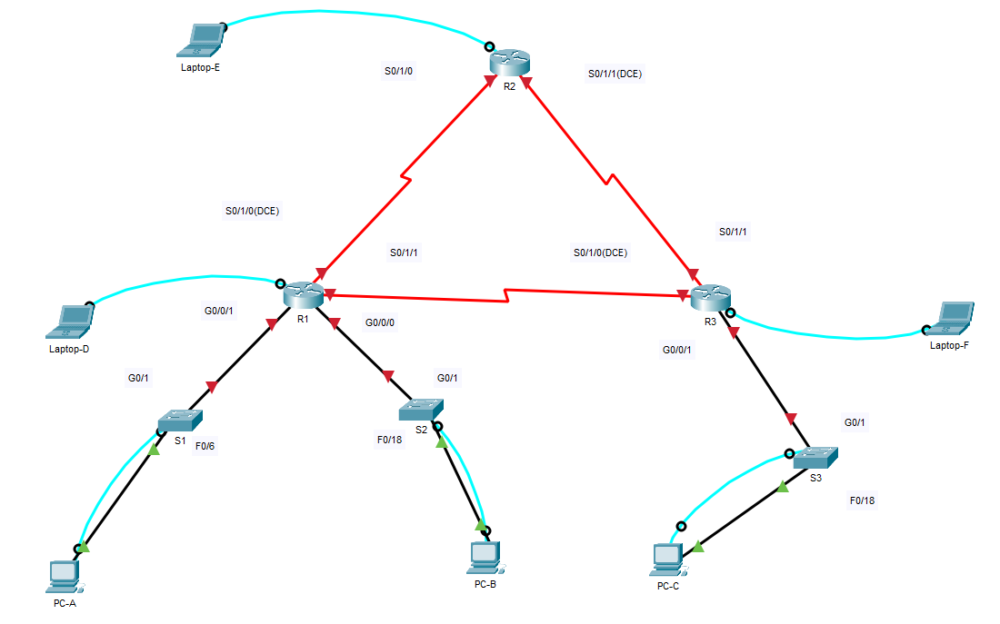
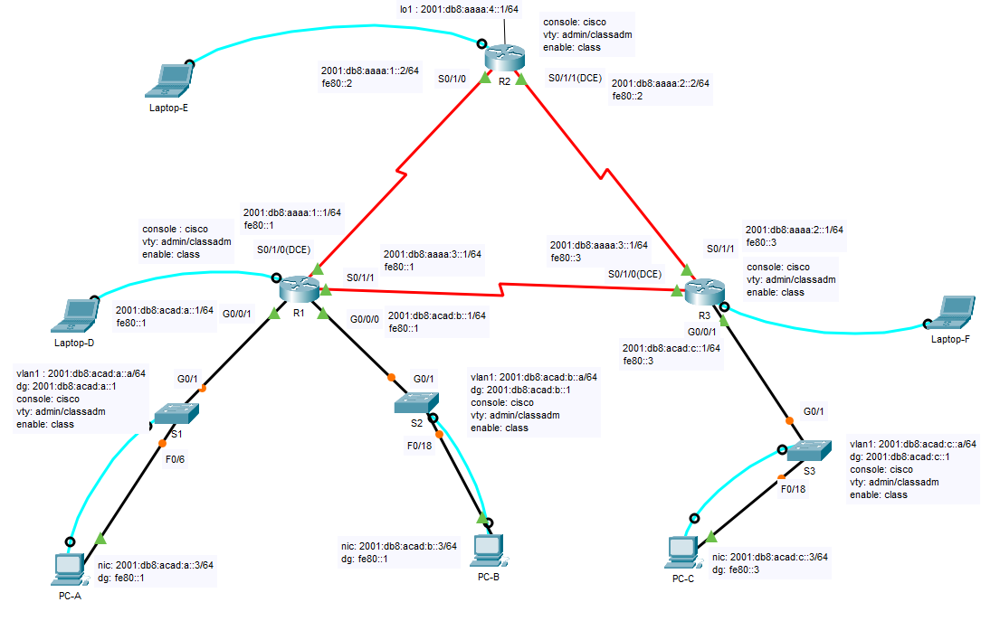

# Instructies Cisco Labo 1, versie copypaste

## Opmerking:
* Deze instructies bevatten alle uit te voeren instructies per device
* Dit moet vooral tijdswinst opleveren tijdens het werken met echte devices.
* Er wordt van uitgegaan dat de devices reeds aangeschakeld zijn en de bekabeling correct is aangebracht volgens de tabel in de instructies en zoals in volgend [bestand](pkt/labo1_01_na_deel1_stap1.pkt) / toplogie:
</br>  

  

* Tijdens een eerste poging op de echte devices werden wat verschillen tussen Packet Tracer en het echte leven vastgesteld en daartoe werd beslist de originele opgave op volgende punten aan te passen:
  * De seriële kabels zijn niet gemarkeerd en de voorgestelde clock rate is niet beschikbaar als keuze: De default clock rate wordt gebruikt waardoor ook geen tijd verspild wordt door omgekeerd aangesloten kabels (DCE/DTE) 
  * Aangezien telnet wordt afgeraden : SSH only voor de vty lijnen

## Instructies

### Bekabeling netwerklokaal

* (*): dubbele vermelding, verbinding zou er reeds moeten zijn indien onderstaande tabel in volgorde wordt afgelopen:

| Device | Van | Device | Naar | Kabel |
| :----: | :-: | :----: | :-:  | :---: |
| S1 | console achter| patchpaneel | 7.16 | UTP |
| S1 | F0/6 | patchpaneel | 7.15 | UTP |
| S1 | G0/1 | R1 | G0/0/1 | UTP |
| S2 | console achter | patchpaneel | 8.16 | UTP |
| S2 | F0/18 | patchpaneel | 8.15 | UTP |
| S2 | G0/1 | R1 | G0/0/0 | UTP |
| S3 | console achter| patchpaneel | 9.16 | UTP |
| S3 | F0/18 | patchpaneel | 9.15 | UTP |
| S3 | G0/1 | R1 | G0/0/1 | UTP |
| R1 | console voor | patchpaneel | 10.16 | UTP |
| R1 | G0/0/1 | S1 | G0/1 | UTP (*) |
| R1 | G0/0/0 | S2 | G0/1 | UTP (*) |
| R1 | S0/1/0 | R2 | S0/1/0 | Serial |
| R1 | S0/1/1 | R3 | S0/1/0 | Serial |
| R2 | console voor | patchpaneel | 11.16 | UTP |
| R2 | S0/1/0 | R1 | S0/1/0 | Serial (*) | 
| R2 | S0/1/1 | R3 | S0/1/1 | Serial |
| R3 | console voor | patchpaneel | 12.16 | UTP |
| R3 | G0/0/1 | S3 | G0/1 | UTP (*) |
| R3 | S0/1/0 | R1 | S0/1/1 | Serial (*) |
| R3 | S0/1/1 | R2 | S0/1/1 | Serial (*) |
| eiland 7 | 7.16 | PC-A | USB | console |
| eiland 7 | 7.15 | PC-A | NIC | UTP |
| eiland 8 | 8.16 | PC-B | USB | console |
| eiland 8 | 8.15 | PC-B | NIC | UTP |
| eiland 9 | 9.16 | PC-C | USB | console |
| eiland 9 | 9.15 | PC-C | NIC | UTP |
| eiland 10 | 10.16 | Laptop-D | USB | console |
| eiland 11 | 11.16 | Laptop-E | USB | console |
| eiland 12 | 12.16 | Laptop-F | USB | console |

### PC's  
* Stel IPv6 adressen in op de NIC:  


| Device | Interface | Link-local | IPv6 Address | DG |
| :-- | :-- | :-- | :-- | :-- |
| PC-A | NIC | aut | 2001:DB8:ACAD:A::3/64 | FE80::1 |
| PC-B | NIC | aut | 2001:DB8:ACAD:B::3/64 | FE80::1 |
| PC-C | NIC | aut | 2001:DB8:ACAD:C::3/64 | FE80::3 |

### S1
* Log in via puTTY en druk na opstarten van de switch op RETURN
* Ga na of opkuisen en initialiseren nodig is:
```code
enable
show vlan brief
show sdm prefer
show run
```
* Opkuisen en initialiseren voor ipv6 indien nodig: copypaste onderstaande instructies (in één keer) na de 'Switch>' prompt:
```code
enable
delete vlan.dat
vlan.dat
y
erase startup-config
y
configure terminal
sdm prefer dual-ipv4-and-ipv6 default
end
reload
no
y

```

* Na het herstarten onderstaande instructies copypasten:
```code
enable
configure terminal
no ip domain lookup
hostname S1
ip domain name ccna-lab.com
service password-encryption
banner motd %Toegang voor onbevoegden is verboden. (S1: console: cisco, enable: class, ssh: admin/classadm)%
user admin secret classadm
enable secret class
crypto key generate rsa general-keys modulus 1024

```
```code
line con 0
password cisco
login
line vty 0 15
login local
transport input ssh
interface vlan 1
ipv6 address 2001:db8:acad:a::a/64
no shutdown
exit
ipv6 route ::/0 2001:DB8:ACAD:A::1
end

```
* ENKEL indien noodzakelijk:
```code
copy running-config startup-config
startup-config
reload
y

```
* Na het labo:
```code
erase startup-config
y
reload

```
### S2
* Log in via puTTY en druk na opstarten van de switch op RETURN
* Ga na of opkuisen en initialiseren nodig is:
```code
enable
show vlan brief
show sdm prefer
show run
```
* Opkuisen en initialiseren voor ipv6 indien nodig:
```code
enable
delete vlan.dat
vlan.dat
y
erase startup-config
y
configure terminal
sdm prefer dual-ipv4-and-ipv6 default
end
reload
no
y

```

* Na het herstarten onderstaande instructies copypasten (in één keer) na de 'Switch>' prompt:
```code
enable
configure terminal
no ip domain lookup
hostname S2
ip domain name ccna-lab.com
service password-encryption
banner motd %Toegang voor onbevoegden is verboden. (S2: console: cisco, enable: class, ssh: admin/classadm)%
user admin secret classadm
enable secret class
crypto key generate rsa general-keys modulus 1024

```
```code
line con 0
password cisco
login
line vty 0 15
login local
transport input ssh
interface vlan 1
ipv6 address 2001:db8:acad:b::a/64
no shutdown
exit
ipv6 route ::/0 2001:DB8:ACAD:B::1
end

```
* ENKEL indien noodzakelijk:
```code
copy running-config startup-config
startup-config
reload
y

```
* Na het labo:
```code
erase startup-config
y
reload

```
### S3
* Log in via puTTY en druk na opstarten van de switch op RETURN
* Ga na of opkuisen en initialiseren nodig is:
```code
enable
show vlan brief
show sdm prefer
show run
```
* Opkuisen en initialiseren voor ipv6 indien nodig: copypaste onderstaande instructies (in één keer) na de 'Switch>' prompt:
```code
enable
delete vlan.dat
vlan.dat
y
erase startup-config
y
configure terminal
sdm prefer dual-ipv4-and-ipv6 default
end
reload
no
y

```

* Na het herstarten onderstaande instructies copypasten:
```code
enable
configure terminal
no ip domain lookup
hostname S3
ip domain name ccna-lab.com
service password-encryption
banner motd %Toegang voor onbevoegden is verboden. (S3: console: cisco, enable: class, ssh: admin/classadm)%
user admin secret classadm
enable secret class
crypto key generate rsa general-keys modulus 1024

```
```code
line con 0
password cisco
login
line vty 0 15
login local
transport input ssh
interface vlan 1
ipv6 address 2001:db8:acad:c::a/64
no shutdown
exit
ipv6 route ::/0 2001:DB8:ACAD:C::1
end

```
* ENKEL indien noodzakelijk:
```code
copy running-config startup-config
startup-config
reload
y

```
* Na het labo:
```code
erase startup-config
y
reload

```

### R1
* log in via puTTY en druk na opstarten van de router op RETURN
* ga na of opkuisen en initialiseren nodig is:
```code
enable
show run
```
* opkuisen indien nodig: copypaste onderstaande instructies (in één keer) na de 'Router>' prompt:
```code
enable
erase startup-config
y
reload
y

```

* na het herstarten 'no' antwoorden en RETURN drukken
* onderstaande instructies copypasten:
```code
enable
configure terminal
no ip domain lookup
hostname R1
ip domain name ccna-lab.com
service password-encryption
banner motd %Toegang voor onbevoegden is verboden. (R1: console: cisco, enable: class, ssh: admin/classadm)%
user admin secret classadm
enable secret class
crypto key generate rsa general-keys modulus 1024

```
```code
ipv6 unicast-routing
ipv6 router ospf 10
router-id 1.1.1.1
passive-interface g0/0/0
passive-interface g0/0/1
line con 0
password cisco
login
line vty 0 4
login local
transport input ssh
interface g0/0/0
ipv6 address fe80::1 link-local
ipv6 address 2001:db8:acad:b::1/64
ipv6 ospf 10 area 0
no shutdown
exit

```
```code
interface g0/0/1
ipv6 address fe80::1 link-local
ipv6 address 2001:db8:acad:a::1/64
ipv6 ospf 10 area 0
no shutdown
exit

```
```code
interface s0/1/0
ipv6 address fe80::1 link-local
ipv6 address 2001:db8:aaaa:1::1/64
ipv6 ospf 10 area 0
!clock rate 128000
no shutdown
exit

```
```code
interface s0/1/1
ipv6 address fe80::1 link-local
ipv6 address 2001:db8:aaaa:3::1/64
ipv6 ospf 10 area 0
no shutdown
end

```
* ENKEL indien noodzakelijk:
```code
copy running-config startup-config
startup-config
reload
y

```
* Na het labo:
```code
erase startup-config
y
reload

```

### R2
* Log in via puTTY en druk na opstarten van de router op RETURN
* Ga na of opkuisen en initialiseren nodig is:
```code
enable
show run
```
* Opkuisen indien nodig: copypaste onderstaande instructies (in één keer) na de 'Router>' prompt:
```code
enable
erase startup-config
y
reload
y

```

* Na het herstarten 'no' antwoorden en RETURN drukken
* Onderstaande instructies copypasten:
```code
enable
configure terminal
no ip domain lookup
hostname R2
ip domain name ccna-lab.com
service password-encryption
banner motd %Toegang voor onbevoegden is verboden. (R2: console: cisco, enable: class, ssh: admin/classadm)%
user admin secret classadm
enable secret class
crypto key generate rsa general-keys modulus 1024

```
```code
ipv6 unicast-routing
ipv6 router ospf 10
router-id 2.2.2.2
default-information originate
line con 0
password cisco
login
line vty 0 4
login local
transport input all
interface lo1
ipv6 address 2001:db8:aaaa:4::1/64
exit

```
```code
interface s0/1/0
ipv6 address fe80::2 link-local
ipv6 address 2001:db8:aaaa:1::2/64
ipv6 ospf 10 area 0
no shutdown
exit

```
```code
interface s0/1/1
ipv6 address fe80::2 link-local
ipv6 address 2001:db8:aaaa:2::2/64
ipv6 ospf 10 area 0
!clock rate 128000
no shutdown
exit

```
```code
ipv6 route ::/0 lo1
end
```
* ENKEL indien noodzakelijk:
```code
copy running-config startup-config
startup-config
reload
y

```
* Na het labo:
```code
erase startup-config
y
reload

```
### R3
* log in via puTTY en druk na opstarten van de router op RETURN
* ga na of opkuisen en initialiseren nodig is:
```code
enable
show run
```
* opkuisen indien nodig: copypaste onderstaande instructies (in één keer) na de 'Router>' prompt:
```code
enable
erase startup-config
y
reload
y

```

* na het herstarten 'no' antwoorden en RETURN drukken
* onderstaande instructies copypasten:
```code
enable
configure terminal
no ip domain lookup
hostname R3
ip domain name ccna-lab.com
service password-encryption
banner motd %Toegang voor onbevoegden is verboden. (R3: console: cisco, enable: class, ssh: admin/classadm)%
user admin secret classadm
enable secret class
crypto key generate rsa general-keys modulus 1024

```
```code
ipv6 unicast-routing
ipv6 router ospf 10
router-id 3.3.3.3
passive-interface g0/0/1
line con 0
password cisco
login
line vty 0 4
login local
transport input all
interface g0/0/1
ipv6 address fe80::3 link-local
ipv6 address 2001:db8:acad:c::1/64
ipv6 ospf 10 area 0
no shutdown
exit

```
```code
interface s0/1/0
ipv6 address fe80::3 link-local
ipv6 address 2001:db8:aaaa:3::2/64
ipv6 ospf 10 area 0
!clock rate 128000
no shutdown
exit

```
```code
interface s0/1/1
ipv6 address fe80::3 link-local
ipv6 address 2001:db8:aaaa:2::1/64
ipv6 ospf 10 area 0
no shutdown
end

```
* ENKEL indien noodzakelijk:
```code
copy running-config startup-config
startup-config
reload
y

```
* Na het labo:
```code
erase startup-config
y
reload

```

## Testing

* De devices kunnen (enkel) via SSH worden bereikt
* Pingen volgens onderstaande tabel / topolgie zou moeten mogelijk zijn:

| Device | Interface | Link-local | IPv6 Address | DG |
| :-- | :-- | :-- | :-- | :-- |
| R1 | S0/1/0(DCE) | FE80::1 | 2001:DB8:AAAA:1::1/64 | - |
| | S0/1/1 | FE80::1 | 2001:DB8:AAAA:3::1/64 | - |
| | G0/0/0 | FE80::1 | 2001:DB8:ACAD:B::1/64 | - |
| | G0/0/1 | FE80::1 | 2001:DB8:ACAD:A::1/64 | - |
| R2| S0/1/0 | FE80::2| 2001:DB8:AAAA:1::2/64 | - |
| | S0/1/1(DCE) | FE80::2 | 2001:DB8:AAAA:3::1/64 | - |
| | Lo1 | - | 2001:DB8:AAAA:4::1/64 | - |
| R3 | S0/1/0(DCE) | FE80::3 | 2001:DB8:AAAA:3::2/64 | - |
| | S0/1/1 | FE80::3 | 2001:DB8:AAAA:2::1/64 | - |
| | G0/0/1 | FE80::3 | 2001:DB8:ACAD:C::1/64 | - |
| S1 | VLAN1 | aut | 2001:DB8:ACAD:A::A/64 | 2001:DB8:ACAD:A::1 |
| S2 | VLAN1 | aut | 2001:DB8:ACAD:B::A/64 | 2001:DB8:ACAD:B::1 |
| S3 | VLAN1 | aut | 2001:DB8:ACAD:C::A/64 | 2001:DB8:ACAD:C::1 |
| PC-A | NIC | aut | 2001:DB8:ACAD:A::3/64 | FE80::1 |
| PC-B | NIC | aut | 2001:DB8:ACAD:B::3/64 | FE80::1 |
| PC-C | NIC | aut | 2001:DB8:ACAD:C::3/64 | FE80::3 |

</br>  

  