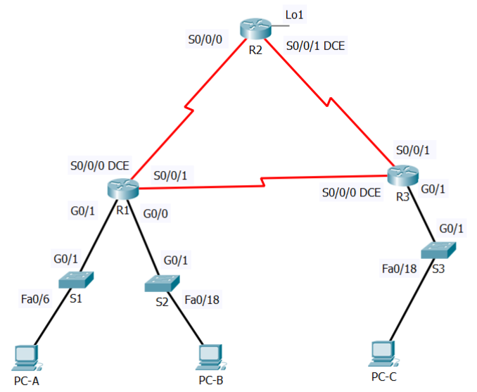
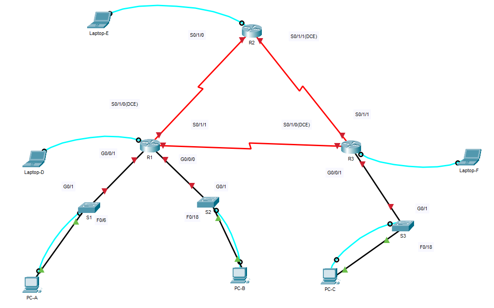

# Instructies Cisco Labo 1

## Opmerking:
* Deze instructies zijn een rapport van het verwerken van de [(aangepaste) opgave](labo1_opgave.md).
* Ze kunnen zowel voor het uitvoeren in Packet Tracer als voor het fysiek uitvoeren in het netwerklokaal worden gebruikt.
* Er is ook een [versie](labo1_copypaste_instructies.md) met alle uit te voeren instructies per device, welke vooral gericht is om tijdswinst te bekomen tijdens het werken met echte devices.
* Vertrekkende van een [leeg .pkt bestand](pkt/labo1_00_leeg.pkt) kunnen deze instructies stapsgewijs gevolgd worden om tot een werkend labo te komen.
* Er kan ook vertrokken worden van de bestanden die na iedere stap beschikbaar zijn om tijd te winnen.

## Gegeven:

### Volgende opstelling:


### Bijhorende adressentabel:
| Device | Interface | Link-local | IPv6 Address | DG |
| :-- | :-- | :-- | :-- | :-- |
| R1 | S0/1/0(DCE) | FE80::1 | 2001:DB8:AAAA:1::1/64 | - |
| | S0/1/1 | FE80::1 | 2001:DB8:AAAA:3::1/64 | - |
| | G0/0/0 | FE80::1 | 2001:DB8:ACAD:B::1/64 | - |
| | G0/0/1 | FE80::1 | 2001:DB8:ACAD:A::1/64 | - |
| R2| S0/1/0 | FE80::2| 2001:DB8:AAAA:1::2/64 | - |
| | S0/1/1(DCE) | FE80::2 | 2001:DB8:AAAA:3::1/64 | - |
| | Lo1 | - | 2001:DB8:AAAA:4::1/64 | - |
| R3 | S0/1/0(DCE) | FE80::3 | 2001:DB8:AAAA:3::2/64 | - |
| | S0/1/1 | FE80::3 | 2001:DB8:AAAA:2::1/64 | - |
| | G0/0/1 | FE80::3 | 2001:DB8:ACAD:C::1/64 | - |
| S1 | VLAN1 | aut | 2001:DB8:ACAD:A::A/64 | 2001:DB8:ACAD:A::1 |
| S2 | VLAN1 | aut | 2001:DB8:ACAD:B::A/64 | 2001:DB8:ACAD:B::1 |
| S3 | VLAN1 | aut | 2001:DB8:ACAD:C::A/64 | 2001:DB8:ACAD:C::1 |
| PC-A | NIC | aut | 2001:DB8:ACAD:A::3/64 | FE80::1 |
| PC-B | NIC | aut | 2001:DB8:ACAD:B::3/64 | FE80::1 |
| PC-C | NIC | aut | 2001:DB8:ACAD:C::3/64 | FE80::3 |


## Deel 1: maak de netwerkopstelling en initialiseer de toestellen

### Stap 1: bouw de netwerkopstelling uit overeenkomstig de gegeven topologie

* Om in Packet Tracer ook reeds wat de echte situatie te simuleren worden naast de drie gevraagde PC's ook enkele Laptops voorzien.
* Ook worden alle devices met een consolekabel aangesloten om de configuratie uit te voeren.
* Bij de geselecteerde routers dienen in Packet Tracer ook nog de seriële interfaces op het toestel worden gesleept (met uitgeschakeld toestel):   

  

* In het netwerklokaal is het aangewezen extra aandacht te besteden aan het aansluiten van de seriële kabels (DCE aan de juiste kant).
* Ook nakijken of de toestellen ingeschakeld zijn is aangewezen.
* Na het uitvoeren van deze instructies is volgende opstelling voorhanden:

    

* In Packet Tracer levert dit [volgend .pkt bestand](pkt/labo1_01_na_deel1_stap1.pkt) op, van waar eventueel ook kan begonnen worden om enkel de volgende stappen (vanaf deel 1, stap 2) uit te voeren.

### Stap 2: initialiseer of reload eventueel de routers en switchen: zorg er dus voor dat er geen oude configuratie meer op de toestellen staat

* Om connectie met de devices te maken via de console kabel gebruiken we een terminal emulator</br>
* In Packet Tracer vinden we die onder het tabblad 'Desktop' bij 'Terminal', wanneer op de aangesloten Pc/Laptop klikken:  

    
    
* Op de eigen laptop in het netwerklabo via bijvoorbeeld PuTTY, warbij de juist 'COM'-poort is te vinden onder 'Apparaatbeheer':  


  
* Zou moeten opleveren (afbeelding wijkt af naargelang geselecteerd device en aangesloten kabels uiteraard):  


  </br>

* Op elke router in het netwerklokaal: de vorig configuratie wissen en reloaden:
  ```code
  Dirty-Router>enable
  Dirty-Router#erase startup-config
  Erasing the nvram filesystem will remove all configuration files! Continue? [confirm]
  [OK]
  Erase of nvram: complete
  %SYS-7-NV_BLOCK_INIT: Initialized the geometry of nvram
  Dirty-Router#reload
  Proceed with reload? [confirm]
  ```

* Op elke switch in het netwerklokaal: de vorig configuratie wissen en reloaden:
  ```code
  Dirty-Switch>enable
  Dirty-Switch#delete vlan.dat
  Delete filename [vlan.dat]?
  Delete flash:/vlan.dat? [confirm]

  Dirty-Switch#erase startup-config
  Erasing the nvram filesystem will remove all configuration files! Continue? [confirm]
  [OK]
  Erase of nvram: complete
  %SYS-7-NV_BLOCK_INIT: Initialized the geometry of nvram
  Dirty-Switch#reload
  System configuration has been modified. Save? [yes/no]:no
  Proceed with reload? [confirm]
  ```

* Op elke switch is het bovendien reeds aan te raden om deze te initialiseren voor ipv6-gebuik later, zodat niet tijdens de configuratie moet worden gereload: Switches intitialiseren
  ```code
  Switch>enable
  Switch#show sdm prefer
   The current template is "default" template.
   The selected template optimizes the resources in
   the switch to support this level of features for
   0 routed interfaces and 1024 VLANs.

   number of unicast mac addresses:                  8K
   number of IPv4 IGMP groups + multicast routes:    0.25K
   number of IPv4 unicast routes:                    0
   number of IPv6 multicast groups:                  0
   number of directly-connected IPv6 addresses:      0
   number of indirect IPv6 unicast routes:           0
   number of IPv4 policy based routing aces:         0
   number of IPv4/MAC qos aces:                      0.125k
   number of IPv4/MAC security aces:                 0.375k
   number of IPv6 policy based routing aces:         0
   number of IPv6 qos aces:                          20
   number of IPv6 security aces:                     25

  Switch#configure terminal
  Enter configuration commands, one per line.  End with CNTL/Z.
  Switch(config)#sdm prefer dual-ipv4-and-ipv6 default
  Changes to the running SDM preferences have been stored, but cannot take effect until the next reload.
  Use 'show sdm prefer' to see what SDM preference is currently active.
  Switch(config)#end
  Switch#
  %SYS-5-CONFIG_I: Configured from console by console
  
  Switch#reload
  System configuration has been modified. Save? [yes/no]:no
  Proceed with reload? [confirm]
  ```

* Na uitvoeren van voorgaande instructie in Packet Tracer levert dit [volgend .pkt bestand](pkt/labo1_02_na_deel1_stap2.pkt) op, van waar eventueel ook kan begonnen worden om enkel de volgende stappen (vanaf deel 2, stap 1) uit te voeren.


## DEEL 2: configureer alle toestellen en controleer de verbindingen

### Stap 1: configureer de IPv6 adressen op alle PC’s
* Configureer de IPv6 global unicast adressen overeenkomstig de gegeven adressentabel. Gebruik het link-local adres als default-gateway op alle Pc’s.

  | Device | Interface | Link-local | IPv6 Address | DG |
  | :-- | :-- | :-- | :-- | :-- |
  | PC-A | NIC | aut | 2001:DB8:ACAD:A::3/64 | FE80::1 |
  | PC-B | NIC | aut | 2001:DB8:ACAD:B::3/64 | FE80::1 |
  | PC-C | NIC | aut | 2001:DB8:ACAD:C::3/64 | FE80::3 |

* In Packet Tracer kan dit ingesteld worden onder het tabblad 'Desktop' bij 'Ip Configuration':  


    
    
* De configuratie op de eigen laptop in het netwerklabo gebeurt overenkomstig dezelfde tabel, maar is natuurlijk afhankelijk van het geïnstalleerde besturingssysteem, dus buiten de scope van deze instructies.
* Na het uitvoeren van de instructies voor deel2, stap 1 is volgende opstelling voorhanden:

    

* Na uitvoeren van voorgaande instructie in Packet Tracer levert dit [volgend .pkt bestand](pkt/labo1_03_na_deel2_stap1.pkt) op, van waar eventueel ook kan begonnen worden om enkel de volgende stappen (vanaf deel 2, stap 2) uit te voeren.

### Stap 2: configureer de switchen  
Maak connectie met de switches via de console kabel zoals beschreven in deel 1, stap 2
<ol type="a">
  <li>Maak DNS lookup ongedaan.</li>  

  ```code
  Press RETURN to get started!


  %LINK-5-CHANGED: Interface FastEthernet0/6, changed state to up
 
  %LINEPROTO-5-UPDOWN: Line protocol on Interface FastEthernet0/6, changed state to up


  Switch>enable
  Switch#configure terminal
  Enter configuration commands, one per line.  End with CNTL/Z.
  Switch(config)#no ip domain-lookup
  ```
  <li>Configureer een hostname.</li>  

  ```code
  Switch(config)#hostname S1
  ```
  <li>Wijs volgende domeinnaam toe: <strong>ccna-lab.com</strong>.</li>  

  ```code
  S1(config)#ip domain-name ccna-lab.com
  ```
  <li>Encrypteer de plain-text paswoorden.</li>  

  ```code
  S1(config)#service password-encryption
  ```
  <li>Maak een MOTD-banner die de gebruikers waarschuwt:“Toegang voor onbevoegden is verboden”.</li>  

  ```code
  S1(config)#banner motd %Toegang voor onbevoegden is verboden%
  ```
  <li>Maak een lokale user database met een gebruikersnaam <strong>admin</strong> en paswoord <strong>classadm</strong>.</li>  

  ```code
  S1(config)#user admin secret classadm
  ```
  <li>Configureer <strong>class</strong> als het privileged EXEC geëncrypteerd paswoord.</li>  

  ```code
  S1(config)#enable secret class
  ```
  <li>Configureer <strong>cisco</strong> als het console paswoord en maak login mogelijk.</li>  

  ```code
  S1(config)#line con 0
  S1(config-line)#password cisco
  S1(config-line)#login
  ```
  <li>Maak login op de VTY-lijnen mogelijk door gebruik te maken van de lokale database.</li>  

  ```code
  S1(config-line)#line vty 0 15
  S1(config-line)#login local
  ```
  <li>Genereer een crypto rsa key voor ssh, gebruik makend van een modulus grootte van 1024 bits.</li>  

  ```code
  S1(config)#crypto key generate rsa general-keys modulus 1024
  The name for the keys will be: S1.ccna-lab.com

  % The key modulus size is 1024 bits
  % Generating 1024 bit RSA keys, keys will be non-exportable...[OK]
  *Mar 1 0:32:30.91: %SSH-5-ENABLED: SSH 1.99 has been enabled
  ```
  <li>Verander de transport input op alle VTY-lijnen naar alleen SSH en Telnet.</li>  
  (eigenlijk de standaard)  

  ```code
  S1(config)#line vty 0 15
  S1(config-line)#transport input all
  ```
  <li>Wijs een IPv6 adres toe aan VLAN 1 overeenkomstig de adrestabel.</li>  

  | Device | Interface | Link-local | IPv6 Address | DG |
  | :-- | :-- | :-- | :-- | :-- |
  | S1 | VLAN1 | aut | 2001:DB8:ACAD:A::A/64 | 2001:DB8:ACAD:A::1 |
  | S2 | VLAN1 | aut | 2001:DB8:ACAD:B::A/64 | 2001:DB8:ACAD:B::1 |
  | S3 | VLAN1 | aut | 2001:DB8:ACAD:C::A/64 | 2001:DB8:ACAD:C::1 |  

  ```code
  S1(config-line)#interface vlan 1
  S1(config-if)#ipv6 address 2001:db8:acad:a::a/64
  S1(config-if)#no shutdown

  S1(config-if)#
  %LINK-5-CHANGED: Interface Vlan1, changed state to up

  %LINEPROTO-5-UPDOWN: Line protocol on Interface Vlan1, changed state to up

  S1(config-if)#exit
  S1(config)#ipv6 route ::/0 2001:db8:acad:a::1
  ```
</ol>

<strong>Voeg hier tussen de runningconfiguration file van S1.</strong>  

```code
S1#show running-config
Building configuration...

Current configuration : 1354 bytes
!
version 15.0
no service timestamps log datetime msec
no service timestamps debug datetime msec
service password-encryption
!
hostname S1
!
!
enable secret 5 $1$mERr$9cTjUIEqNGurQiFU.ZeCi1
!
!
!
no ip domain-lookup
ip domain-name ccna-lab.com
!
username admin secret 5 $1$mERr$9P2hZCa4NCXndhXS4QhPs0
!
!
!
spanning-tree mode pvst
spanning-tree extend system-id
!
interface FastEthernet0/1
!
interface FastEthernet0/2
!
interface FastEthernet0/3
!
interface FastEthernet0/4
!
interface FastEthernet0/5
!
interface FastEthernet0/6
!
interface FastEthernet0/7
!
interface FastEthernet0/8
!
interface FastEthernet0/9
!
interface FastEthernet0/10
!
interface FastEthernet0/11
!
interface FastEthernet0/12
!
interface FastEthernet0/13
!
interface FastEthernet0/14
!
interface FastEthernet0/15
!
interface FastEthernet0/16
!
interface FastEthernet0/17
!
interface FastEthernet0/18
!
interface FastEthernet0/19
!
interface FastEthernet0/20
!
interface FastEthernet0/21
!
interface FastEthernet0/22
!
interface FastEthernet0/23
!
interface FastEthernet0/24
!
interface GigabitEthernet0/1
!
interface GigabitEthernet0/2
!
interface Vlan1
 no ip address
 ipv6 address 2001:DB8:ACAD:A::A/64
!
banner motd ^CToegang voor onbevoegden is verboden^C
!
!
!
ipv6 route ::/0 2001:DB8:ACAD:A::1
!
!
line con 0
 password 7 0822455D0A16
 login
!
line vty 0 4
 login local
line vty 5 15
 login local
!
!
!
!
end
```

Opmerking : De praktijk leert dat het saven en herladen van de instellingen soms onverklaarbare problemen oplost:
  ```code
  S1(config)#end
  S1#copy running-config startup-config
  Destination filename [startup-config]? startup-config
  Building configuration...
  [OK]
  S1#reload
  %SYS-5-CONFIG_I: Configured from console by console
  
  Proceed with reload? [confirm]
  ```

* Uiteraard worden op de andere switches gelijkaardige commando's uitgevoerd
* Na het uitvoeren van de instructies voor deel2, stap 2 is volgende opstelling voorhanden:

  

* Na uitvoeren van voorgaande instructie in Packet Tracer levert dit [volgend .pkt bestand](pkt/labo1_04_na_deel2_stap2.pkt) op, van waar eventueel ook kan begonnen worden om enkel de volgende stappen (vanaf deel 2, stap 3) uit te voeren.

### Stap 3: configureer de basisinstellingen op alle routers
Maak connectie met de routers via de console kabel zoals beschreven in deel 1, stap 2
  ```code
  Would you like to enter the initial configuration dialog? [yes/no]: no
  
  
  Press RETURN to get started!
  
  
  
  Router>
  ```
<ol type="a">
  <li>Maak DNS lookup ongedaan.</li>  

  ```code
  Router>enable
  Router#configure terminal
  Enter configuration commands, one per line.  End with CNTL/Z.
  Router(config)#no ip domain lookup
  ```
  <li>Configureer een hostname.</li>  

  ```code
  Router(config)#hostname R1
  ```
  <li>Wijs volgende domeinnaam toe: <strong>ccna-lab.com</strong>.</li>  

  ```code
  R1(config)#ip domain name ccna-lab.com
  ```
  <li>Encrypteer de plain-text paswoorden.</li>  

  ```code
  R1(config)#service password-encryption
  ```
  <li>Maak een MOTD-bannerdie de gebruikers waarschuwt: “Toegang voor onbevoegden is verboden”.</li>  

  ```code
  R1(config)#banner motd %Toegang voor onbevoegden is verboden%
  ```
  <li>Maak een lokale user database met een gebruikersnaam <strong>admin</strong> en paswoord <strong>classadm</strong>.</li>  

  ```code
  R1(config)#user admin secret classadm
  ```
  <li>Configureer <strong>class</strong> als het privileged EXEC geëncrypteerd paswoord.</li>  

  ```code
  R1(config)#enable secret class
  ```
  <li>Configureer <strong>cisco</strong> als het console paswoord en maak login mogelijk.</li>  

  ```code
  R1(config)#line con 0
  R1(config-line)#password cisco
  R1(config-line)#login
  ```
  <li>Maak login op de VTY-lijnen mogelijk door gebruik te maken van de lokale database.</li>  

  ```code
  R1(config-line)#line vty 0 4
  R1(config-line)#login local
  ```
  <li>Genereer een crypto rsa key voor ssh, gebruik makend van een modulus grootte van 1024 bits.</li>  

  ```code
  R1(config)#crypto key generate rsa general-keys modulus 1024
  The name for the keys will be: R1.ccna-lab.com

  % The key modulus size is 1024 bits
  % Generating 1024 bit RSA keys, keys will be non-exportable...[OK]
  *Mar 1 0:6:16.764: %SSH-5-ENABLED: SSH 1.99 has been enabled
  ```
  <li>Verander de transport input op alle VTY-lijnen naar alleen SSH en Telnet.</li>  

  ```code
  R1(config)#line vty 0 4
  R1(config-line)#transport input all
  ```
</ol>

* Na het uitvoeren van de instructies voor deel2, stap 3 is volgende opstelling voorhanden:

  

* Na uitvoeren van voorgaande instructie in Packet Tracer levert dit [volgend .pkt bestand](pkt/labo1_05_na_deel2_stap3.pkt) op, van waar eventueel ook kan begonnen worden om enkel de volgende stappen (vanaf deel 2, stap 4) uit te voeren.


### Stap 4: configureer IPv6 instellingen op R1
<ol type="a">
  <li>Configureer de IPv6 unicast adressen op de volgende interfaces: G0/0/0, G0/0/1, S0/1/0 en S0/1/1.</li>  

  ```code
  R1(config)#interface g0/0/0
  R1(config-if)#ipv6 address 2001:db8:acad:b::1/64
  R1(config-if)#no shutdown
  
  %LINK-5-CHANGED: Interface GigabitEthernet0/0/0, changed state to up
  
  %LINEPROTO-5-UPDOWN: Line protocol on Interface GigabitEthernet0/0/0, changed state to up
  
  R1(config-if)#interface g0/0/1
  R1(config-if)#ipv6 address 2001:db8:acad:a::1/64
  R1(config-if)#no shutdown
  
  %LINK-5-CHANGED: Interface GigabitEthernet0/0/1, changed state to up
  
  %LINEPROTO-5-UPDOWN: Line protocol on Interface GigabitEthernet0/0/1, changed state to up

  R1(config-if)#interface s0/1/0
  R1(config-if)#ipv6 address 2001:db8:aaaa:1::1/64
  R1(config-if)#no shutdown
  
  %LINK-5-CHANGED: Interface Serial0/1/0, changed state to down
  R1(config-if)#interface s0/1/1
  R1(config-if)#ipv6 address 2001:db8:aaaa:3::1/64
  R1(config-if)#no shutdown

  %LINK-5-CHANGED: Interface Serial0/1/1, changed state to down
  ```
  <li>Configureer de IPv6 link-local adressen op de volgende interfaces: G0/0/0, G0/0/1, S0/1/0 en S0/1/1. Gebruik FE80::1</li>  

  ```code
  R1(config)#interface g0/0/0
  R1(config-if)#ipv6 address fe80::1 link-local
  R1(config-if)#interface g0/0/1
  R1(config-if)#ipv6 address fe80::1 link-local
  R1(config-if)#interface s0/1/0
  R1(config-if)#ipv6 address fe80::1 link-local
  R1(config-if)#interface s0/1/1
  R1(config-if)#ipv6 address fe80::1 link-local
  ```
  <li>Zet de clock rate op S0/1/0 op 128000.</li>  

  ```code
  R1(config)#interface s0/1/0
  R1(config-if)#clock rate 128000
  ```

  <li>Zorg ervoor dat de interfaces IPv6-pakketten kunnen versturen.</li>  

  ```code
  R1(config)#interface s0/1/0
  R1(config-if)#interface g0/0/0
  R1(config-if)#ipv6 enable
  R1(config-if)#interface g0/0/1
  R1(config-if)#ipv6 enable
  R1(config-if)#interface s0/1/0
  R1(config-if)#ipv6 enable
  R1(config-if)#interface s0/1/1
  R1(config-if)#ipv6 enable  
  ```

  <li>Maak IPv6 unicast routing mogelijk  

  ```code
  R1(config)#ipv6 unicast-routing
  ```
  </li>
  <li>Configureer OSPFv3 op R1 en zorg dat de LAN-interfaces passieve interfaces zijn.</li>  

  ```code
  R1(config)#ipv6 router ospf 10
  %OSPFv3-4-NORTRID: OSPFv3 process 10 could not pick a router-id,please configure manually
  R1(config-rtr)#router-id 1.1.1.1
  R1(config-rtr)#passive-interface g0/0/0
  R1(config-rtr)#passive-interface g0/0/1
  R1(config-rtr)#int g0/0/0
  R1(config-if)#ipv6 ospf 10 area 0
  R1(config-if)#int g0/0/1
  R1(config-if)#ipv6 ospf 10 area 0
  R1(config-if)#int s0/1/0
  R1(config-if)#ipv6 ospf 10 area 0
  R1(config-if)#int s0/1/1
  R1(config-if)#ipv6 ospf 10 area 0
  ```

</ol>
<strong>Voeg hier tussen de runningconfiguration file van R1.</strong>  

```code
R1#show run
Building configuration...

Current configuration : 1456 bytes
!
version 15.4
no service timestamps log datetime msec
no service timestamps debug datetime msec
service password-encryption
!
hostname R1
!
!
!
enable secret 5 $1$mERr$9cTjUIEqNGurQiFU.ZeCi1
!
!
!
!
!
!
no ip cef
ipv6 unicast-routing
!
no ipv6 cef
!
!
!
username admin secret 5 $1$mERr$9P2hZCa4NCXndhXS4QhPs0
!
!
!
!
!
!
!
!
no ip domain-lookup
ip domain-name ccna-lab.com
!
!
spanning-tree mode pvst
!
!
!
!
!
!
interface GigabitEthernet0/0/0
 no ip address
 duplex auto
 speed auto
 ipv6 address FE80::1 link-local
 ipv6 address 2001:DB8:ACAD:B::1/64
 ipv6 enable
 ipv6 ospf 10 area 0
!
interface GigabitEthernet0/0/1
 no ip address
 duplex auto
 speed auto
 ipv6 address FE80::1 link-local
 ipv6 address 2001:DB8:ACAD:A::1/64
 ipv6 enable
 ipv6 ospf 10 area 0
!
interface Serial0/1/0
 no ip address
 ipv6 address FE80::1 link-local
 ipv6 address 2001:DB8:AAAA:1::1/64
 ipv6 enable
 ipv6 ospf 10 area 0
 clock rate 128000
!
interface Serial0/1/1
 no ip address
 ipv6 address FE80::1 link-local
 ipv6 address 2001:DB8:AAAA:3::1/64
 ipv6 enable
 ipv6 ospf 10 area 0
!
interface Vlan1
 no ip address
 shutdown
!
ipv6 router ospf 10
 router-id 1.1.1.1
 log-adjacency-changes
 passive-interface GigabitEthernet0/0/0
 passive-interface GigabitEthernet0/0/1
!
ip classless
!
ip flow-export version 9
!
!
!
banner motd ^CToegang voor onbevoegden is verboden^C
!
!
!
!
line con 0
 password 7 0822455D0A16
 login
!
line aux 0
!
line vty 0 4
 login local
!
!
!
end
```

* Na het uitvoeren van de instructies voor deel2, stap 4 is volgende opstelling voorhanden:

  

* Na uitvoeren van voorgaande instructie in Packet Tracer levert dit [volgend .pkt bestand](pkt/labo1_06_na_deel2_stap4.pkt) op, van waar eventueel ook kan begonnen worden om enkel de volgende stappen (vanaf deel 2, stap 5) uit te voeren.

### Stap 5: configureer IPv6 instellingen op R2
<ol type="a">
  <li>Configureer de IPv6 unicast adressen op de volgende interfaces: Lo1, S0/1/0> en S0/1/1.</li>  

  ```code
  R2(config)#interface lo1

  R2(config-if)#ipv6 address 2001:db8:aaaa:4::1/64
  %LINK-5-CHANGED: Interface Loopback1, changed state to up

  %LINEPROTO-5-UPDOWN: Line protocol on Interface Loopback1, changed state to up

  R2(config-if)#interface s0/1/0
  R2(config-if)#ipv6 address 2001:db8:aaaa:1::2/64
  R2(config-if)#no shutdown

  %LINK-5-CHANGED: Interface Serial0/1/0, changed state to up
  
  %LINEPROTO-5-UPDOWN: Line protocol on Interface Serial0/1/0, changed state to up

  R2(config-if)# interface s0/1/1
  R2(config-if)#ipv6 address 2001:db8:aaaa:2::2/64
  R2(config-if)#no shutdown

  %LINK-5-CHANGED: Interface Serial0/1/1, changed state to down
  ```
  <li>Configureer de IPv6 link-local adressen op de volgende interfaces: S0/1/0 en S0/1/1. Gebruik FE80::2</li>  

  ```code
  R2(config)#int s0/1/0
  R2(config-if)#ipv6 address fe80::2 link-local
  R2(config-if)#int s0/1/1
  R2(config-if)#ipv6 address fe80::2 link-local
  ```
  <li>Zet de clock rate op S0/1/1 op 128000.</li>  

  ```code
  R2(config-if)#interface s0/1/1
  R2(config-if)#clock rate 128000
  ```
  <li>Zorg ervoor dat de interfaces IPv6-pakketten kunnen versturen.</li>  

  ```code
  R2(config)#int lo1
  R2(config-if)#ipv6 enable
  R2(config-if)#int s0/1/0
  R2(config-if)#ipv6 enable
  R2(config-if)#int s0/1/1
  R2(config-if)#ipv6 enable
  ```
  <li>Maak IPv6 unicast routing mogelijk.</li>  

  ```code
  R2(config)#ipv6 unicast-routing
  ```
  <li>Maak een default route die gebruik maakt van de loopback interface Lo1 (deze dient ter simulatie van een internetconnectie).</li>  

  ```code
  R2(config)#ipv6 route ::/0 lo1
  ```
  <li>Configureer OSPFv3 op R2 en zorg dat de default route doorgegeven wordt op de andere routers van het domein.</li>  

  ```code
  R2(config)#ipv6 router ospf 10
  %OSPFv3-4-NORTRID: OSPFv3 process 10 could not pick a router-id,please configure manually
  R2(config-rtr)#router-id 2.2.2.2
  R2(config-rtr)#default-information originate
  R2(config-rtr)#int s0/1/0
  R2(config-if)#ipv6 ospf 10 area 0

  00:21:50: %OSPFv3-5-ADJCHG: Process 10, Nbr 1.1.1.1 on Serial0/1/0 from LOADING to FULL, Loading Done
  
  R2(config-if)#int s0/1/1
  R2(config-if)#ipv6 ospf 10 area 0
  ```
  </ul> 
</ol>


<strong>Voeg hier tussen de runningconfiguration file van R2.</strong>  

```code
R2#show run
Building configuration...

Current configuration : 1343 bytes
!
version 15.4
no service timestamps log datetime msec
no service timestamps debug datetime msec
service password-encryption
!
hostname R2
!
!
!
enable secret 5 $1$mERr$9cTjUIEqNGurQiFU.ZeCi1
!
!
!
!
!
!
ip cef
ipv6 unicast-routing
!
no ipv6 cef
!
!
!
username admin secret 5 $1$mERr$9P2hZCa4NCXndhXS4QhPs0
!
!
!
!
!
!
!
!
no ip domain-lookup
ip domain-name ccna-lab.com
!
!
spanning-tree mode pvst
!
!
!
!
!
!
interface Loopback1
 no ip address
 ipv6 address 2001:DB8:AAAA:4::1/64
 ipv6 enable
!
interface GigabitEthernet0/0/0
 no ip address
 duplex auto
 speed auto
 shutdown
!
interface GigabitEthernet0/0/1
 no ip address
 duplex auto
 speed auto
 shutdown
!
interface Serial0/1/0
 no ip address
 ipv6 address FE80::2 link-local
 ipv6 address 2001:DB8:AAAA:1::2/64
 ipv6 enable
 ipv6 ospf 10 area 0
!
interface Serial0/1/1
 no ip address
 ipv6 address FE80::2 link-local
 ipv6 address 2001:DB8:AAAA:2::2/64
 ipv6 enable
 ipv6 ospf 10 area 0
 clock rate 128000
!
interface Vlan1
 no ip address
 shutdown
!
ipv6 router ospf 10
 router-id 2.2.2.2
 default-information originate
 log-adjacency-changes
!
ip classless
!
ip flow-export version 9
!
ipv6 route ::/0 Loopback1
!
!
no cdp run
!
banner motd ^CToegang voor onbevoegden is verboden^C
!
!
!
!
line con 0
 password 7 0822455D0A16
 login
!
line aux 0
!
line vty 0 4
 login local
!
!
!
end
```

* Na het uitvoeren van de instructies voor deel2, stap 5 is volgende opstelling voorhanden:

    

* Na uitvoeren van voorgaande instructie in Packet Tracer levert dit [volgend .pkt bestand](pkt/labo1_06_na_deel2_stap5.pkt) op, van waar eventueel ook kan begonnen worden om enkel de volgende stappen (vanaf deel 2, stap 6) uit te voeren.

### Stap 6: configureer IPv6 instellingen op R3
<ol type="a">
  <li>Configureer de IPv6 unicast adressen op de volgende interfaces: G0/0/1, S0/1/0 en S0/1/1.</li>  

  ```code
  R3(config)#interface g0/0/1
  R3(config-if)#ipv6 address 2001:db8:acad:c::1/64
  R3(config-if)#no shutdown

  %LINK-5-CHANGED: Interface GigabitEthernet0/0/1, changed state to up

  R3(config-if)#interface s0/1/0
  R3(config-if)#ipv6 address 2001:db8:aaaa:3::2/64
  R3(config-if)#no shutdown

  %LINK-5-CHANGED: Interface Serial0/1/0, changed state to up

  %LINEPROTO-5-UPDOWN: Line protocol on Interface Serial0/1/0, changed state to up

  R3(config-if)#interface s0/1/1
  R3(config-if)#ipv6 address 2001:db8:aaaa:2::1/64
  R3(config-if)#no shutdown

  %LINK-5-CHANGED: Interface Serial0/1/1, changed state to up
  
  %LINEPROTO-5-UPDOWN: Line protocol on Interface Serial0/1/1, changed state to up
  ```
  <li>Configureer de IPv6 link-local adressen op de volgende interfaces: G0/0/1, S0/1/0 en S0/1/1. Gebruik FE80::3</li>  

  ```code
  R3(config-if)#int g0/0/1
  3(config-if)#ipv6 add fe80::3 link-local
  R3(config-if)#int s0/1/0
  R3(config-if)#ipv6 add fe80::3 link-local
  R3(config-if)#int s0/1/1
  R3(config-if)#ipv6 add fe80::3 link-local
  ```

  <li>Zet de clock rate op S0/1/0 op 128000.</li>  

  ```code
  R3(config-if)#interface s0/1/0
  R3(config-if)#clock rate 128000
  ```

  <li>Zorg ervoor dat de interfaces IPv6-pakketten kunnen versturen.</li>  

  ```code
  R3(config-if)#int g0/0/1
  R3(config-if)#ipv6 enable
  R3(config-if)#int s0/1/0
  R3(config-if)#ipv6 enable
  R3(config-if)#int s0/1/1
  R3(config-if)#ipv6 enable
  ```

  <li>Maak IPv6 unicast routing mogelijk.</li>  

  ```code
  R3(config)#ipv6 unicast-routing
  ```

  <li>Configureer OSPFv3 op R3 en maak van de LAN-interface een passieve interface.</li>  

  ```code
  R3(config)#ipv6 router ospf 10
  %OSPFv3-4-NORTRID: OSPFv3 process 10 could not pick a router-id,please configure manually
  R3(config-rtr)#router-id 3.3.3.3
  R3(config-rtr)#passive-interface g0/0/1
  R3(config-rtr)#int g0/0/1
  R3(config-if)#ipv6 ospf 10 area 0
  R3(config-if)#int s0/1/0
  R3(config-if)#ipv6 ospf 10 area 0
  
  00:13:31: %OSPFv3-5-ADJCHG: Process 10, Nbr 1.1.1.1 on Serial0/1/0 from LOADING to FULL, Loading Done

  R3(config-if)#int s0/1/1
  R3(config-if)#ipv6 ospf 10 area 0
  
  00:13:50: %OSPFv3-5-ADJCHG: Process 10, Nbr 2.2.2.2 on Serial0/1/1 from LOADING to FULL, Loading Done
  ```


</ol>
<strong>Voeg hier tussen de runningconfiguration file van R3.</strong>  

```code
R3#show run
Building configuration...

Current configuration : 1333 bytes
!
version 15.4
no service timestamps log datetime msec
no service timestamps debug datetime msec
service password-encryption
!
hostname R3
!
!
!
enable secret 5 $1$mERr$9cTjUIEqNGurQiFU.ZeCi1
!
!
!
!
!
!
ip cef
ipv6 unicast-routing
!
no ipv6 cef
!
!
!
username admin secret 5 $1$mERr$9P2hZCa4NCXndhXS4QhPs0
!
!
!
!
!
!
!
!
no ip domain-lookup
ip domain-name ccna-lab.com
!
!
spanning-tree mode pvst
!
!
!
!
!
!
interface GigabitEthernet0/0/0
 no ip address
 duplex auto
 speed auto
 shutdown
!
interface GigabitEthernet0/0/1
 no ip address
 duplex auto
 speed auto
 ipv6 address FE80::3 link-local
 ipv6 address 2001:DB8:ACAD:C::1/64
 ipv6 enable
 ipv6 ospf 10 area 0
!
interface Serial0/1/0
 no ip address
 ipv6 address FE80::3 link-local
 ipv6 address 2001:DB8:AAAA:3::2/64
 ipv6 enable
 ipv6 ospf 10 area 0
 clock rate 128000
!
interface Serial0/1/1
 no ip address
 ipv6 address FE80::3 link-local
 ipv6 address 2001:DB8:AAAA:2::1/64
 ipv6 enable
 ipv6 ospf 10 area 0
!
interface Vlan1
 no ip address
 shutdown
!
ipv6 router ospf 10
 router-id 3.3.3.3
 log-adjacency-changes
 passive-interface GigabitEthernet0/0/1
!
ip classless
!
ip flow-export version 9
!
!
!
no cdp run
!
banner motd ^CToegang voor onbevoegden is verboden^C
!
!
!
!
line con 0
 password 7 0822455D0A16
 login
!
line aux 0
!
line vty 0 4
 login local
!
!
!
end
```
* Na het uitvoeren van de instructies voor deel2, stap 6 is volgende opstelling voorhanden:
  

* Na uitvoeren van voorgaande instructie in Packet Tracer levert dit [volgend .pkt bestand](pkt/labo1_06_na_deel2_stap6.pkt) op, van waar eventueel ook kan begonnen worden om enkel de volgende stappen (vanaf deel 2, stap 7) uit te voeren. Deze stap komt overeen met het uitvoeren van het testplan
* Het is eventueel aan te raden de routers te reloaden. De praktijk leert dat dit sommige issues vanzelf oplost:

```code
Rx#copy run start
Destination filename [startup-config]? 
Building configuration...
[OK]
Rx#reload
Proceed with reload? [confirm]
```

* Dit levert [volgend .pkt bestand](pkt/labo1_09_na_reloads.pkt) op. Voer hiermee stap 7 uit.

### Stap 7: Controleer de connectiviteit
<ol type="a">
  <li>Elke PC zou in staat moeten zijn om te pingen naar de andere PC’s in de topology.</li>
  <li>Telnet naar R1 vanuit alle PC’s in de topology.</li>
  <li>SSH naar R1 vanuit alle PC’s in de topology.</li>
  <li>Telnet naar S1 vanuit alle PC’s in de topology.</li>
  <li>SSH naar S1 vanuit alle PC’s in de topology.</li>
  <li>Zorg ervoor dat nu alles werkt: troubleshoot indien nodig</li>
</ol>

Zie [testplan](labo1_testplan_packettracer.md) en [rapport](labo1_testrapport.md)