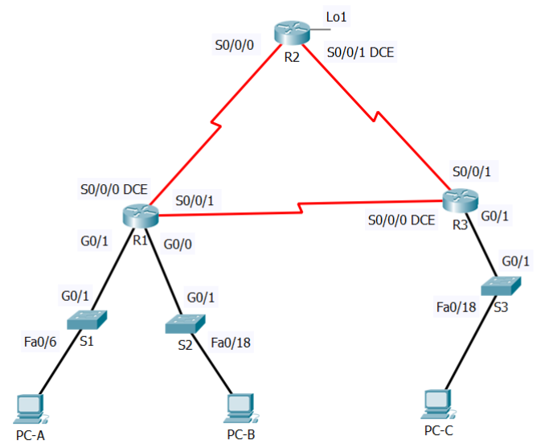

# Opgave Cisco Labo 1

## Opmerking:
Om de op de devices uit te voeren instructies tussen Packet Tracer en de echte devices in het netwerklokaal gelijk te trekken zijn in onderstaande opgave enkele wijzigingen aangebracht ten opzichte van de versie uit de [brochure](pdf/brochure-sep-2223.pdf). Deze zijn <del>doorstreept</del> en/of <ins>onderlijnd</ins> gemarkeerd. Dit is enkel een herwerking van de opgave. Een uitgebreide versie van de opgave met ook alle uit te voeren instructies erbij is [hier](labo1_instructies.md) terug te vinden. Een versie met copypaste instructies per device, ook bruikbaar om de echte devices snel te configureren, is [hier](labo1_copypaste_instructies.md) te vinden.

## Gegeven:

### Volgende opstelling:

### Bijhorende adressentabel:
| Device | Interface | Link-local | IPv6 Address | DG |
| :-- | :-- | :-- | :-- | :-- |
| R1 | <del>S0/0/0</del> <ins>S0/1/0</ins>(DCE) | FE80::1 | 2001:DB8:AAAA:1::1/64 | - |
| | <del>S0/0/1</del> <ins>S0/1/1</ins> | FE80::1 | 2001:DB8:AAAA:3::1/64 | - |
| | <del>G0/0</del> <ins>G0/0/0</ins> | FE80::1 | 2001:DB8:ACAD:B::1/64 | - |
| | <del>G0/1</del> <ins>G0/0/1</ins> | FE80::1 | 2001:DB8:ACAD:A::1/64 | - |
| R2| <del>S0/0/0</del> <ins>S0/1/0</ins> | FE80::2| 2001:DB8:AAAA:1::2/64 | - |
| | <del>S0/0/1</del> <ins>S0/1/1</ins>(DCE) | FE80::2 | 2001:DB8:AAAA:3::1/64 | - |
| | Lo1 | - | 2001:DB8:AAAA:4::1/64 | - |
| R3 | <del>S0/0/0</del> <ins>S0/1/0</ins>(DCE) | FE80::3 | 2001:DB8:AAAA:3::2/64 | - |
| | <del>S0/0/1</del> <ins>S0/1/1</ins> | FE80::3 | 2001:DB8:AAAA:2::1/64 | - |
| | <del>G0/1</del> <ins>G0/0/1</ins> | FE80::3 | 2001:DB8:ACAD:C::1/64 | - |
| S1 | VLAN1 | <ins>aut</ins> | 2001:DB8:ACAD:A::A/64 | <ins>2001:DB8:ACAD:A::1</ins> |
| S2 | VLAN1 | <ins>aut</ins> | 2001:DB8:ACAD:B::A/64 | <ins>2001:DB8:ACAD:B::1</ins> |
| S3 | VLAN1 | <ins>aut</ins> | 2001:DB8:ACAD:C::A/64 | <ins>2001:DB8:ACAD:C::1</ins> |
| PC-A | NIC | <ins>aut</ins> | 2001:DB8:ACAD:A::3/64 | FE80::1 |
| PC-B | NIC | <ins>aut</ins> | 2001:DB8:ACAD:B::3/64 | FE80::1 |
| PC-C | NIC | <ins>aut</ins> | 2001:DB8:ACAD:C::3/64 | FE80::3 |

## Deel 1: maak de netwerkopstelling en initialiseer de toestellen

### Stap 1: bouw de netwerkopstelling uit overeenkomstig de gegeven topologie

### Stap 2: initialiseer of reload eventueel de routers en switchen: zorg er dus voor dat er geen oude configuratie meer op de toestellen staat

## DEEL 2: configureer alle toestellen en controleer de verbindingen

### Stap 1: configureer de IPv6 adressen op alle PC’s
Configureer  de  IPv6  global  unicast  adressen  overeenkomstig  de  gegeven adressentabel. Gebruik het link-local adres als default-gateway op alle Pc’s.

### Stap 2: configureer de switchen  
<ol type="a">
  <li>Maak DNS lookup ongedaan.</li>
  <li>Configureer een hostname.</li>
  <li>Wijs volgende domeinnaam toe: <strong>ccna-lab.com</strong>.</li>
  <li>Encrypteer de plain-text paswoorden.</li>
  <li>Maak een MOTD-banner die de gebruikers waarschuwt:“Toegang voor onbevoegden is verboden”.</li>
  <li>Maak een lokale user database met een gebruikersnaam <strong>admin</strong> en paswoord <strong>classadm</strong>.</li>
  <li>Configureer <strong>class</strong> als het privileged EXEC geëncrypteerd paswoord.</li>
  <li>Configureer <strong>cisco</strong> als het console paswoord en maak login mogelijk.</li>
  <li>Maak login op de VTY-lijnen mogelijk door gebruik te maken van de lokale database.</li>
  <li>Genereer een crypto rsa key voor ssh, gebruik makend van een modulus grootte van 1024 bits.</li>
  <li>Verander de transport input op alle VTY-lijnen naar alleen SSH <del>en Telnet</del>.</li>
  <li>Wijs een IPv6 adres toe aan VLAN 1 overeenkomstig de adrestabel.</li>
</ol>
<strong>Voeg hier tussen de runningconfiguration file van S1.</strong>

### Stap 3: configureer de basisinstellingen op alle routers
<ol type="a">
  <li>Maak DNS lookup ongedaan.</li>
  <li>Configureer een hostname.</li>
  <li>Wijs volgende domeinnaam toe: <strong>ccna-lab.com</strong>.</li>
  <li>Encrypteer de plain-text paswoorden.</li>
  <li>Maak een MOTD-bannerdie de gebruikers waarschuwt: “Toegang voor onbevoegden is verboden”.</li>
  <li>Maak een lokale user database met een gebruikersnaam <strong>admin</strong> en paswoord <strong>classadm</strong>.</li>
  <li>Configureer <strong>class</strong> als het privileged EXEC geëncrypteerd paswoord.</li>
  <li>Configureer <strong>cisco</strong> als het console paswoord en maak login mogelijk.</li>
  <li>Maak login op de VTY-lijnen mogelijk door gebruik te maken van de lokale database.</li>
  <li>Genereer een crypto rsa key voor ssh, gebruik makend van een modulus grootte van 1024 bits.</li>
  <li>Verander de transport input op alle VTY-lijnen naar alleen SSH <del>en Telnet</del>.</li>
</ol>

### Stap 4: configureer IPv6 instellingen op R1
<ol type="a">
  <li>Configureer de IPv6 unicast adressen op de volgende interfaces: <del>G0/0</del> <ins>G0/0/0</ins>, <del>G0/1</del> <ins>G0/0/1</ins>, <del>S0/0/0</del> <ins>S0/1/0</ins> en <del>S0/0/1</del> <ins>S0/1/1</ins>.</li>
  <li>Configureer de IPv6 link-local adressen op de volgende interfaces: <del>G0/0</del> <ins>G0/0/0</ins>, <del>G0/1</del> <ins>G0/0/1</ins>, <del>S0/0/0</del> <ins>S0/1/0</ins> en <del>S0/0/1</del> <ins>S0/1/1</ins>.</li>
  <li>Gebruik FE80::1 voor de link-local adressen op alle vier interfaces.</li>
  <li><del>Zet de clock rate op <del>S0/0/0</del> <ins>S0/1/0</ins> op 128000.</del></li>
  <li>Zorg ervoor dat de interfaces IPv6-pakketten kunnen versturen.</li>
  <li>Maak IPv6 unicast routing mogelijk:
  <ul>
    <li>R(config)# ipv6 unicast-router</li>
  </ul>
  </li>
  <li>Configureer OSPFv3 op R1 en zorg dat de LAN-interfaces passieve interfaces zijn.</li>
  <ul>
    Configuratie OSPFv3:
    <li>R(config)# ipv6 router ospf 10</li>
    <li>R(config-rtr)# passive interface G0/0/0 (indien G0/0/0 de passieve interface is)</li>
    <li>R(config-rtr)# <ins>passive interface G0/0/1</ins></li>
    <li>R(config)# ipv6 router ospf 10</li>
    Dan op elke actieve interface:
    <li>R(config-if)#ipv6 ospf 10 area 0</li>
  </ul> 
</ol>
<strong>Voeg hier tussen de runningconfiguration file van R1.</strong>

### Stap 5: configureer IPv6 instellingen op R2
<ol type="a">
  <li>Configureer de IPv6 unicast adressen op de volgende interfaces: Lo1, <del>S0/0/0</del> <ins>S0/1/0</ins> en <del>S0/0/1</del> <ins>S0/1/1</ins>.</li>
  <li>Configureer de IPv6 link-local adressen op de volgende interfaces: <del>S0/0/0</del> <ins>S0/1/0</ins> en <del>S0/0/1</del> <ins>S0/1/1</ins>.</li>
  <li>Gebruik FE80::2 voor de link-local adressen op alle twee interfaces.</li>
  <li><del>Zet de clock rate op <del>S0/0/1</del> <ins>S0/1/1</ins> op 128000.</del></li>
  <li>Zorg ervoor dat de interfaces IPv6-pakketten kunnen versturen.</li>
  <li>Maak IPv6 unicast routing mogelijk.</li>
  <li>Maak een default route die gebruik maakt van de loopback interface Lo1 (deze dient ter simulatie van een internetconnectie).</li>
  <ul>
    <li>R(config)# ipv6 route ::/0 Lo1</li>
  </ul>
  <li>Configureer OSPFv3 op R2 en zorg dat de default route doorgegeven wordt op de andere routers van het domein.</li>
  <ul>
    Configuratie OSPFv3:
    <li>R(config)# ipv6 router ospf 10</li>
    <li><del>R(config-rtr)# passive interface G0/0/0 (indien G0/0/0 de passieve interface is)</del></li>
    <li><ins>R(config-rtr)#default-information originate</ins></li>
    Dan op elke actieve interface:
    <li>R(config-if)#ipv6 ospf 10 area 0</li>
  </ul> 
  </ul> 
</ol>
<strong>Voeg hier tussen de runningconfiguration file van R2.</strong>

### Stap 6: configureer IPv6 instellingen op R3
<ol type="a">
  <li>Configureer de IPv6 unicast adressen op de volgende interfaces: <del>G0/1</del> <ins>G0/0/1</ins>, <del>S0/0/0</del> <ins>S0/1/0</ins> en <del>S0/0/1</del> <ins>S0/1/1</ins>.</li>
  <li>Configureer de IPv6 link-local adressen op de volgende interfaces: <del>G0/1</del> <ins>G0/0/1</ins>, <del>S0/0/0</del> <ins>S0/1/0</ins> en <del>S0/0/1</del> <ins>S0/1/1</ins>.</li>
  <li>Gebruik FE80::3 voor de link-localadressen op alle drie interfaces.</li>
  <li><del>Zet de clock rate op <del>S0/0/0</del> <ins>S0/1/0</ins> op 128000.</del></li>
  <li>Zorg ervoor dat de interfaces IPv6-pakketten kunnen versturen.</li>
  <li>Maak IPv6 unicast routing mogelijk.</li>
  <li>Configureer OSPFv3 op R3 en maak van de LAN-interface een passieve interface.</li>
  <ul>
    <li>Configuratie zie R1</li>
  </ul>
</ol>
<strong>Voeg hier tussen de runningconfiguration file van R3.</strong>

### Stap 7: Controleer de connectiviteit
<ol type="a">
  <li>Elke PC zou in staat moeten zijn om te pingen naar de andere PC’s in de topology.</li>
  <li><del>Telnet naar R1 vanuit alle PC’s in de topology.</del></li>
  <li>SSH naar R1 vanuit alle PC’s in de topology.</li>
  <li><del>Telnet naar S1 vanuit alle PC’s in de topology.</del></li>
  <li>SSH naar S1 vanuit alle PC’s in de topology.</li>
  <li>Zorg ervoor dat nu alles werkt: troubleshoot indien nodig <del>want de ACLs die je zal maken in DEEL3 gaan de toegang beperken tot bepaalde zones van het netwerk</del></li>
</ol>

### Opmerking:
<del>Tera Term vereist dat het bestemmings IPv6 adres tussen vierkante haakjes staat. Voer het IPv6 adres in zoals in de figuur, klik op <strong>OK</strong> en vervolgens op <strong>Continue</strong> om de beveiligingswaarschuwing te accepteren en te connecteren met de router.</del> <ins>De huidige versie van Packet Tracer kan connecteren via de 'Command Prompt' of via de 'Telnet / SSH Client'</ins>
  

  
Voer  de  geconfigureerde  gebruikerscredentials  in  (gebruikersnaam <strong>admin</strong> en paswoord <strong>classadm</strong>) <del>en selecteer de <strong>Use plain password to log in</strong> in de SSH Authentication dialogue box.</del> Klik op <strong>OK</strong> om verder te gaan.
  

  

