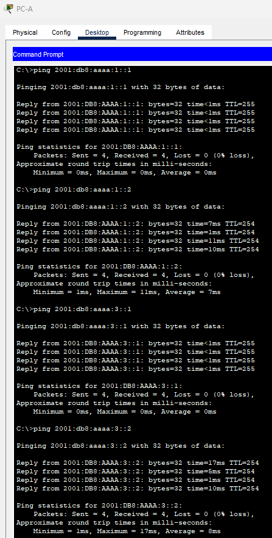
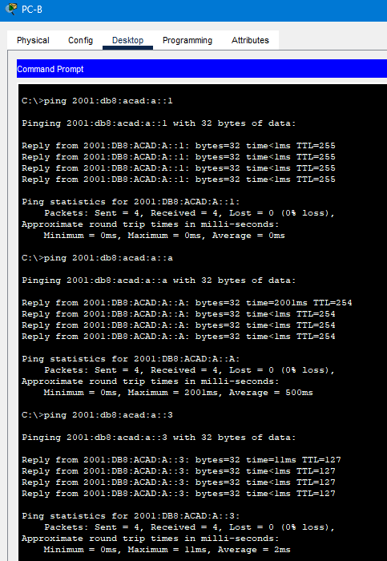
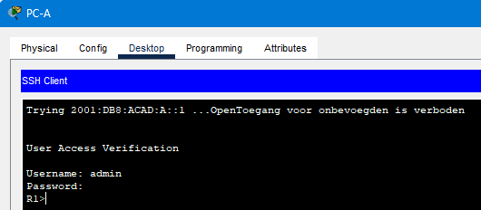

# Testrapport Cisco Labo 1, versie Packet Tracer

(Een testrapport is het verslag van de uitvoering van het testplan door een teamlid (iemand anders dan de auteur van het testplan!). Deze noteert bij elke stap in het testplan of het bekomen resultaat overeenstemt met wat verwacht werd. Indien niet, dan is het belangrijk om gedetailleerd op te geven wat er misloopt, wat het effectieve resultaat was, welke foutboodschappen gegenereerd werden, enz. De tester kan meteen een Github issue aanmaken en er vanuit het testrapport naar verwijzen. Wanneer het probleem opgelost werd, wordt een nieuwe test uitgevoerd, met een nieuw verslag.)

## Test 1

Uitvoerder(s) test: Wim Meirlaen
Uitgevoerd op: 08/03/2023
Github commit:  COMMIT HASH


### Ping:

* Open PC-A door erop te klikken
* Klik onder het tabblad Desktop op het icoon 'Command Prompt' en voer volgende commando's uit, ter controle van de ipv6 instellingen en de connectiviteit binnen het eigen subnet:
  ```code
  ipcongfig

  ping 2001:db8:acad:a::3
  ping 2001:db8:acad:a::a
  ping 2001:db8:acad:a::1
  ping fe80::1
  ```
  ***verwacht***: PC-A heeft ipv6 addres `2001:db8:acad:a::3` en fe80::1 als default gateway. Een link local adres werd automatisch gegenereerd. De devices in het eigen subnet gaven een ping reply terug.

  ***Uitkomst***:
  - De IP-instellingen van PC-A zijn correct:
  

  - De IP-adressen uit het eigen subnet zijn geven allen een ping reply terug:
  


* Volgende commando's controleren de connectiviteit van PC-A naar de netwerken welke rechtstreeks aan R1 zijn verbonden:
  ```code
  ping 2001:db8:acad:b::1
  ping 2001:db8:acad:b::a
  ping 2001:db8:acad:b::3
  ping 2001:db8:aaaa:1::1
  ping 2001:db8:aaaa:1::2
  ping 2001:db8:aaaa:3::1
  ping 2001:db8:aaaa:3::2
  ```
  ***verwacht***: alle devices waren bereikbaar en retourneerden ping replies
  
 ***uitkomst***:
  - De IP-adressen in range 2001:db8:acad:b die rechtstreeks zijn verbonden met R1 geven een ping reply bij pingen vanuit PC-A:
  
  

  - Ook de adressen uit range 2001:db8:aaaa:: die rechtstreeks verbonden zijn met R1 geven een succesvolle ping reply bij pingen vanuit PC-A:

  

* Volgende commando's controleren de connectiviteit van PC-A naar netwerken welke R1 via OSPF heeft aangeleerd:
  ```code
  ping 2001:db8:aaaa:2::1
  ping 2001:db8:aaaa:2::2
  ping 2001:db8:acad:c::1
  ping 2001:db8:acad:c::a
  ping 2001:db8:acad:c::3
  ping 2001:db8:aaaa:4::1
  ```
  ***verwacht*** : alle devices waren bereikbaar en retourneerden ping replies
  
  ***Uitkomst*** :
  - Alle interfaces die door R1 geleerd werden via OSPF zijn bereikbaar vanuit PC-A:


De connectiviteitstest voor PC-A werd onderverdeeld in verschillende tests om eventuele troubleshooting makkelijker te maken. Voor de andere PC's zijn de commando's gelijkaardig

* Open PC-B door erop te klikken
* Klik onder het tabblad Desktop op het icoon 'Command Prompt' en voer onderstaande commando's uit:
  ```code
  ipconfig
  ping 2001:db8:acad:b::3
  ping 2001:db8:acad:b::a
  ping 2001:db8:acad:b::1
  ping fe80::1
  ping 2001:db8:aaaa:1::1
  ping 2001:db8:aaaa:1::2
  ping 2001:db8:aaaa:3::1
  ping 2001:db8:aaaa:3::2
  ping 2001:db8:acad:a::1
  ping 2001:db8:acad:a::a
  ping 2001:db8:acad:a::3
  ping 2001:db8:aaaa:2::1
  ping 2001:db8:aaaa:2::2
  ping 2001:db8:acad:c::1
  ping 2001:db8:acad:c::a
  ping 2001:db8:acad:c::3
  ping 2001:db8:aaaa:4::1
  ```
  ***verwacht***: PC-B kreeg het ipv6 addres `2001:db8:acad:b::3` en fe80::1 als default gateway. Een link local adres werd automatisch gegenereerd. Alle pings waren succesvol
  
  ***Uitkomst***
  - De IP-instellingen van PC-B zijn zoals verwacht:
  
  

  - De IP-adressen binnen het subnet van PC-B zijn bereikbaar:
  
  

  - Ook adressen buiten het subnet van PC-B zijn allen bereikbaar:
  
  
  
  
  
  
  


* Open PC-C door erop te klikken
* Klik onder het tabblad Desktop op het icoon 'Command Prompt' en voer onderstaande commando's uit:
  ```code
  ipconfig
  ping 2001:db8:acad:c::3
  ping 2001:db8:acad:c::a
  ping 2001:db8:acad:c::1
  ping fe80::3
  ping 2001:db8:aaaa:2::1
  ping 2001:db8:aaaa:2::2
  ping 2001:db8:aaaa:3::1
  ping 2001:db8:aaaa:3::2
  ping 2001:db8:aaaa:1::1
  ping 2001:db8:aaaa:1::2
  ping 2001:db8:aaaa:4::1
  ping 2001:db8:acad:a::1
  ping 2001:db8:acad:a::a
  ping 2001:db8:acad:a::3
  ping 2001:db8:acad:b::1
  ping 2001:db8:acad:b::a
  ping 2001:db8:acad:b::3
  ```
  ***verwacht***: PC-C kreeg het ipv6 addres 2001:db8:acad:C::3 en fe80::3 als default gateway. Een link local adres werd automatisch gegenereerd. Alle pings waren succesvol
  
  ***Uitkomst***
  - De IP-instellingen voor PC-C zijn correct:
  
  
  - De IP-adressen binnen het subnet van PC-C geven een correcte ping reply:
  
  - De andere IP-adressen buiten het subnet geven ook een correcte ping reply terug aan PC-C:
  
  
  
  
  


### Remote access (Voer volgende stappen uit vanop alle PC's in de topologie):
* Open de PC door erop te klikken
* Klik onder het tabblad Desktop op het icoon 'Telnet/SSH Client'. Indien de 'command prompt' uit de eerdere tests nog open staat kan deze worden gesloten met 'X'  
  
Telnet naar R1:
* Selecteer Telnet als 'Connection Type'
* Vul `2001:db8:acad:a::1` in in het veld 'Host Name (IP address)' en klik op connect  
  ***verwacht***: er is connectie naar R1, er wordt een waarschuwing (motd) getoond en een Username/Password gevraagd 
* Geef als username ***admin*** en als password ***classadm*** in  
  ***verwacht***: er kon succesvol op R1 worden ingelogd en de prompt 'R1>' is beschikbaar om commando's in te geven
* Typ exit op de prompt en antwoord nee op de vraag of je opnieuw wil connecteren
* 
***Uitkomst*** 

Loginscherm (Telnet van PC-A naar R1):

 

Het aanmelden via telnet op R1 lukt:


    
SSH naar R1:
* Selecteer SSH als 'Connection Type'
* Vul `2001:db8:acad:a::1` in in het veld 'Host Name (IP address)'
* Vul admin in in het veld 'Username' en klik op connect  
  ***verwacht***: er is connectie naar R1 en er wordt om een Password gevraagd
* Geef ***classadm*** als password in  
  ***verwacht***: Een waarschuwing (motd) wordt getoond. Er kon succesvol op R1 worden ingelogd. Een prompt 'R1>' is beschikbaar om commando's in te geven
* Typ exit op de prompt en antwoord nee op de vraag of je opnieuw wil connecteren  


***Uitkomst***

Loginscherm (SSH van PC-A naar R1):


Het aanmelden via SSH van PC-A naar R1 slaagt:


Telnet naar S1:
* Selecteer Telnet als 'Connection Type'
* Vul `2001:db8:acad:a::a` in in het veld 'Host Name (IP address)' en klik op connect  
  ***verwacht***: er is connectie naar de S1, er wordt een waarschuwing (motd) getoond en een Username/Password gevraagd 
* Geef als username ***admin*** en als password ***classadm*** in  
  ***verwacht***: er kon succesvol op S1 worden ingelogd en de prompt 'S1>' is beschikbaar om commando's in te geven
* Typ exit op de prompt en antwoord nee op de vraag of je opnieuw wil connecteren  

***Uitkomst***

Loginscherm PC-A via Telnet naar S1:


Het verbinden via PC-A over Telnet naar S1 is geslaagd:


SSH naar S1:
* Selecteer SSH als 'Connection Type'
* Vul `2001:db8:acad:a::a` in in het veld 'Host Name (IP address)'
* Vul admin in in het veld 'Username' en klik op connect  
  ***verwacht***: er is connectie naar de Router en er wordt om een Password gevraagd
* geef ***classadm*** als password in  
  ***verwacht***: Een waarschuwing (motd) wordt getoond. Er kon succesvol op S1 worden ingelogd. Een prompt 'S1>' is beschikbaar om commando's in te geven
* typ exit op de prompt en antwoord nee op de vraag of je opnieuw wil connecteren

***Uitkomst***

Loginscherm PC-A via SSH naar S1:


Het verbinden via PC-A over SSH naar S1 is geslaagd:


We proberen dit nu opnieuw voor verbinding met de lo1-interface van R2, deze keer vanuit PC-B:
Methode: Telnet
host = 2001:DB8:AAAA:4::1
Dit werkt:


Methode: SSH
host = 2001:DB8:AAAA:4::1


Ook deze test slaagt:


Vervolgens testen we de connectie met R3 vanuit PC-C:
Methode: Telnet
host = 2001:DB8:ACAD:C::1


Deze test slaagt:


Methode: SSH
host = 2001:DB8:ACAD:C::1


Ook deze test is geslaagd:


    
Opmerking:  
* remote access is ook te controleren met behulp van volgende commando's in de 'Command Prompt':
  ```code
  telnet 2001:db8:acad:a::1
  ssh -l admin 2001:db8:acad:a::1
  ```
  ***verwacht***: dezelfde vragen/waarschuwingen als bij de voorgaande methode
  ***uitkomst***
  We testen dit voor PC-C naar R1:
  
  - Met Telnet:
  
  

  - Met SSH:
  
  


