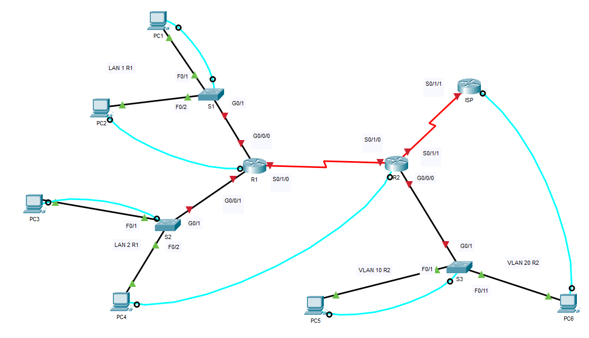
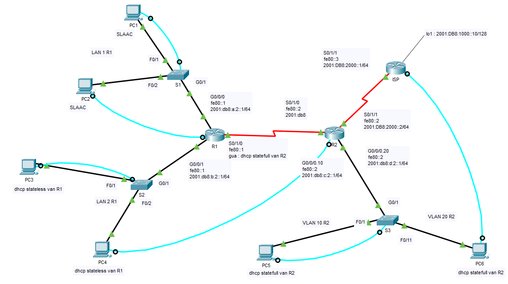

# Instructies Cisco Labo 2, versie copypaste

## Opmerking:

- Deze instructies bevatten alle uit te voeren instructies per device.
- Dit moet vooral tijdswinst opleveren tijdens het werken met echte devices.
- Er wordt van uitgegaan dat de devices reeds aangeschakeld zijn en de bekabeling correct is aangebracht volgens de tabel in de instructies en zoals in volgend [bestand](pkt/labo2_00_netwerklokaal.pkt) / toplogie:



## Instructies

### Bekabeling netwerklokaal

- (\*): dubbele vermelding, verbinding zou er reeds moeten zijn indien onderstaande tabel in volgorde wordt afgelopen:

|  Device   |      Van       |   Device    |  Naar  |    Kabel    |
| :-------: | :------------: | :---------: | :----: | :---------: |
|    S1     | console achter | patchpaneel |  7.16  |     UTP     |
|    S1     |      F0/1      | patchpaneel |  7.15  |     UTP     |
|    S1     |      F0/2      | patchpaneel |  8.15  |     UTP     |
|    S1     |      G0/1      |     R1      | G0/0/0 |     UTP     |
|    R1     |  console voor  | patchpaneel |  8.16  |     UTP     |
|    R1     |     G0/0/0     |     S1      |  G0/1  |  UTP (\*)   |
|    R1     |     G0/0/1     |     S2      |  G0/1  |     UTP     |
|    R1     |     S0/1/0     |     R2      | S0/1/0 |   Serial    |
|    S2     | console achter | patchpaneel |  9.16  |     UTP     |
|    S2     |      F0/1      | patchpaneel |  9.15  |     UTP     |
|    S2     |      F0/2      | patchpaneel | 10.15  |     UTP     |
|    S2     |      G0/1      |     R1      | G0/0/1 |  UTP (\*)   |
|    R2     |  console voor  | patchpaneel | 10.16  |     UTP     |
|    R2     |     S0/1/0     |     R1      | S0/1/0 | Serial (\*) |
|    R2     |     S0/1/1     |     ISP     | S0/1/1 |   Serial    |
|    R2     |     G0/0/0     |     S3      |  G0/1  |     UTP     |
|    S3     | console achter | patchpaneel | 11.16  |     UTP     |
|    S3     |      F0/1      | patchpaneel | 11.15  |     UTP     |
|    S3     |     F0/11      | patchpaneel | 12.15  |     UTP     |
|    S3     |      G0/1      |     R2      | G0/0/0 |  UTP (\*)   |
|    ISP    |  console voor  | patchpaneel | 12.16  |     UTP     |
|    ISP    |     S0/1/1     |     R2      | S0/1/1 | Serial (\*) |
| eiland 7  |      7.15      |     PC1     |  NIC   |     UTP     |
| eiland 7  |      7.16      |     PC1     |  USB   |   console   |
| eiland 8  |      8.15      |     PC2     |  NIC   |     UTP     |
| eiland 8  |      8.16      |     PC2     |  USB   |   console   |
| eiland 9  |      9.15      |     PC3     |  NIC   |     UTP     |
| eiland 9  |      9.16      |     PC3     |  USB   |   console   |
| eiland 10 |     10.15      |     PC4     |  NIC   |     UTP     |
| eiland 10 |     10.16      |     PC4     |  USB   |   console   |
| eiland 11 |     11.15      |     PC5     |  NIC   |     UTP     |
| eiland 11 |     11.16      |     PC5     |  USB   |   console   |
| eiland 12 |     12.15      |     PC6     |  NIC   |     UTP     |
| eiland 12 |     12.16      |     PC6     |  USB   |   console   |

### R1

- log in via puTTY en druk na opstarten van de router op RETURN
- ga na of opkuisen en initialiseren nodig is:

```code
enable
show run
```

- opkuisen indien nodig: copypaste onderstaande instructies (in één keer) na de 'Router>' prompt:

```code
enable
erase startup-config
y
reload
y

```

- na het herstarten 'no' antwoorden en RETURN drukken
- onderstaande instructies copypasten:

```code
enable
configure terminal
hostname R1
ipv6 unicast-routing
ipv6 dhcp pool R1-LAN2-IPV6-STATELESS
dns-server 2001:db8:1000::10
domain-name SystemEngineeringProject
interface g0/0/0
description link naar R1 LAN1
ipv6 address fe80::1 link-local
ipv6 address 2001:db8:a:2::1/64
no shutdown
exit

```
```code
interface g0/0/1
description link naar R1 LAN2
ipv6 address fe80::1 link-local
ipv6 address 2001:db8:b:2::1/64
ipv6 dhcp server R1-LAN2-IPV6-STATELESS
ipv6 nd other-config-flag
no shutdown
exit

```
```code
interface s0/1/0
description link naar R2
ipv6 address fe80::1 link-local
ipv6 address dhcp
no shutdown
exit

```
```code
ipv6 route ::/0 Serial0/1/0 FE80::2
end
```

- indien noodzakelijk:

```code
copy running-config startup-config
startup-config
reload
y

```

- Na het labo:

```code
erase startup-config
y
reload

```

### R2

- log in via puTTY en druk na opstarten van de router op RETURN
- ga na of opkuisen en initialiseren nodig is:

```code
enable
show run
```

- opkuisen indien nodig: copypaste onderstaande instructies (in één keer) na de 'Router>' prompt:

```code
enable
erase startup-config
y
reload
y

```

- na het herstarten 'no' antwoorden en RETURN drukken
- onderstaande instructies copypasten:

```code
enable
configure terminal
hostname R2
ipv6 unicast-routing
ipv6 dhcp pool R2-VLAN10-IPV6-STATEFULL
dns-server 2001:db8:1000::10
domain-name SystemEngineeringProject
address prefix 2001:db8:c:2::/64
exit
ipv6 dhcp pool R2-VLAN20-IPV6-STATEFULL
dns-server 2001:db8:1000::10
domain-name SystemEngineeringProject
address prefix 2001:db8:d:2::/64
exit
ipv6 dhcp pool R2-SERIAL-IPV6-STATEFULL
dns-server 2001:db8:1000::10
domain-name SystemEngineeringProject
address prefix 2001:db8:acdc:2::/64
exit
interface s0/1/0
description link naar R1
ipv6 addres fe80::2 link-local
ipv6 address 2001:db8:acdc:2::1/64
ipv6 dhcp server R2-SERIAL-IPV6-STATEFULL
ipv6 nd managed-config-flag
ipv6 nd other-config-flag
ipv6 nd prefix 2001:db8:acdc:2::/64 no-autoconfig
no shutdown
exit

```
```code
interface s0/1/1
description link naar ISP
ipv6 addres fe80::2 link-local
ipv6 address 2001:DB8:2000::2/64
no shutdown
exit

```
```code
interface g0/0/0
description trunk naar S2
no shutdown
exit

```
```code
interface g0/0/0.10
description link naar R2 VLAN 10
ipv6 addres fe80::2 link-local
ipv6 address 2001:db8:c:2::1/64
encapsulation dot1Q 10
ipv6 dhcp server R2-VLAN10-IPV6-STATEFULL
ipv6 nd managed-config-flag
ipv6 nd other-config-flag
ipv6 nd prefix 2001:db8:c:2::/64 no-autoconfig
exit

```
```code
interface g0/0/0.20
description link naar R2 VLAN 20
ipv6 addres fe80::2 link-local
ipv6 address 2001:db8:d:2::1/64
encapsulation dot1Q 20
ipv6 dhcp server R2-VLAN20-IPV6-STATEFULL
ipv6 nd managed-config-flag
ipv6 nd other-config-flag
ipv6 nd prefix 2001:db8:d:2::/64 no-autoconfig
exit

```
```code
ipv6 route 2001:DB8:A:2::/64 Serial0/1/0
ipv6 route 2001:DB8:B:2::/64 Serial0/1/0
ipv6 route ::/0 2001:DB8:2000::1
end
```

- ENKEL indien noodzakelijk:

```code
copy running-config startup-config
startup-config
reload
y

```

- Na het labo:

```code
erase startup-config
y
reload

```

### S1 en S2

- Log in via puTTY en druk na opstarten van de switch op RETURN
- Ga na of opkuisen en initialiseren nodig is:

```code
enable
show vlan brief
show run
```

- Opkuisen indien nodig: copypaste onderstaande instructies (in één keer) na de 'Switch>' prompt:

```code
enable
delete vlan.dat
vlan.dat
y
erase startup-config
y
reload
y

```

### S3

- Log in via puTTY en druk na opstarten van de switch op RETURN
- Ga na of opkuisen en initialiseren nodig is:

```code
enable
show vlan brief
show run
```

- Opkuisen indien nodig: copypaste onderstaande instructies (in één keer) na de 'Switch>' prompt:

```code
enable
delete vlan.dat
vlan.dat
y
erase startup-config
y
reload
y

```

- Na het herstarten onderstaande instructies copypasten:

```code
enable
configure terminal
hostname S3
vlan 10
name TIEN
exit
vlan 20
name TWINTIG
exit
interface g0/1
switchport mode trunk
exit
interface range f0/1-10
switchport mode access
switchport access vlan 10
exit
interface range f0/11-20
switchport mode access
switchport access vlan 20
end

```

- ENKEL indien noodzakelijk:

```code
copy running-config startup-config
startup-config
reload
y

```

- controle:

```code
show interfaces trunk
show vlan brief
```

- Na het labo:

```code
enable
delete vlan.dat
vlan.dat
y
erase startup-config
y
reload
y

```

## ISP

- log in via puTTY en druk na opstarten van de router op RETURN
- ga na of opkuisen en initialiseren nodig is:

```code
enable
show run
```

- opkuisen indien nodig: copypaste onderstaande instructies (in één keer) na de 'Router>' prompt:

```code
enable
erase startup-config
y
reload
y

```

- na het herstarten 'no' antwoorden en RETURN drukken
- onderstaande instructies copypasten:

```code
enable
configure terminal
hostname ISP
ipv6 unicast-routing
interface loopback 1
ipv6 address 2001:db8:1000::10/128
no shutdown
exit

```
```code
interface s0/1/1
ipv6 address fe80::3 link-local
ipv6 address 2001:db8:2000::1/64
no shutdown
exit

```
```code
ipv6 route 2001:db8:a:2::/64 s0/1/1
ipv6 route 2001:db8:b:2::/64 s0/1/1
ipv6 route 2001:db8:c:2::/64 s0/1/1
ipv6 route 2001:db8:d:2::/64 s0/1/1
end
```

- ENKEL indien noodzakelijk:

```code
copy running-config startup-config
startup-config
reload
y

```

- Na het labo:

```code
erase startup-config
y
reload

```

## Eindresultaat:



## Controle

Vanop elke pc:

```code
ipconfig /all
ping 2001:db8:1000::10
```
