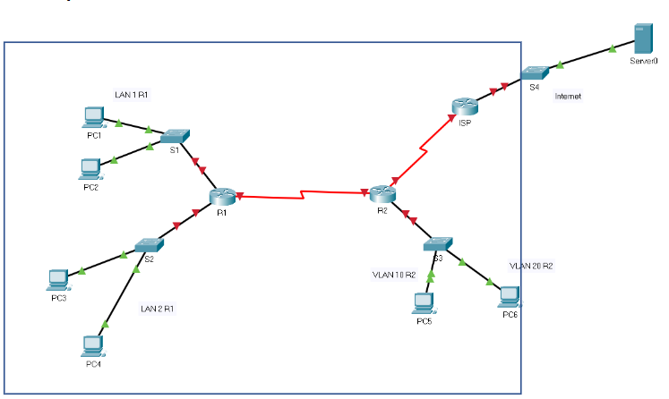

# Instructies Cisco Labo 2, versie Packet Tracer

## Opmerking:
Deze instructies volgen stapsgewijs de [herwerkte opgave](labo2_opgave.md) van labo 2. Met behulp van deze instructies kan vanaf het [startbestand](pkt/labo2_00_chamilo.pkt) een succesvol resultaat bekomen worden. De instructies om in het netwerklokaal een succesvol resultaat te bekomen wijken licht af en worden best vanaf [dit aangepast bestand](pkt/labo2_00_netwerklokaal.pkt) uitgevoerd. Hierbij zijn [deze instructies](labo2_copypaste_instructies.md) het bruikbaarst.

## Gegeven:

### Volgende opstelling:


### Bijhorend .pkt bestand:
Gebruik de bijbehorende Packet Tracer file: <del>Opgave  DHCPv6  met  statische routesklaar voor configuratie.pkt (Zie Chamilo)</del> <ins>[opgave](pkt/labo2_00_chamilo.pkt)</ins>

### Labo-opdracht:
Bouw  het  netwerk  binnen de kader uit. Vervang hierbij de interface naar het internet of dus Server0 door een loopback interface op de ISP-router <ins>met als ipv6 adres 2001:db8:1000::10</ins>.

## Opdracht:

### 1. Gebruik volgende netwerkadressen

| Groep        | LAN 1 R1/64    | LAN 2 R1/64    | VLAN 10 R2/64  | VLAN 20 R2/64  | Seriële link R1-R2/64     |
| :--          | :--            | :--            | :--            | :--            | :--               |
| Groep 1 TIAO | 2001:db8:A:2:: | 2001:db8:B:2:: | 2001:db8:C:2:: | 2001:db8:D:2:: | 2001:db8:ACDC:2:: |


### 2. R1  
<ol type="a">
  <li>Link local adres op alle interfaces = FE80::1</li>

  ```code
  Router>enable
  Router#configure terminal
  Enter configuration commands, one per line.  End with CNTL/Z.
  Router(config)#interface g0/0/0
  Router(config-if)#ipv6 addres fe80::1 link-local
  Router(config-if)#no shutdown

  %LINK-5-CHANGED: Interface GigabitEthernet0/0/0, changed state to up

  %LINEPROTO-5-UPDOWN: Line protocol on Interface GigabitEthernet0/0/0, changed state to up

  Router(config)#interface g0/0/1
  Router(config-if)#ipv6 addres fe80::1 link-local
  Router(config-if)#no shutdown

  %LINK-5-CHANGED: Interface GigabitEthernet0/0/0, changed state to up

  %LINEPROTO-5-UPDOWN: Line protocol on Interface GigabitEthernet0/0/0, changed state to up
  
  Router(config)#interface s0/1/0
  Router(config-if)#ipv6 addres fe80::1 link-local
  Router(config-if)#no shutdown
  
  %LINK-5-CHANGED: Interface Serial0/1/0, changed state to down
  ```
  <li>Configureer alle interfaces eerst. Neem telkens als interface ID = 1, behalve S0/1/0</li>

  ```code
  Router(config)#interface g0/0/0
  Router(config-if)#ipv6 address 2001:db8:a:2::1/64
  Router(config-if)#interface g0/0/1
  Router(config-if)#ipv6 address 2001:db8:b:2::1/64
  ```
  <li>G0/0/0 wordt geactiveerd voor SLAAC => PC1 en PC2 krijgen hun IPv6-adres via SLAAC</li>

  ```code
  Router(config)#ipv6 unicast-routing
  ```
  <ins>Stel de ipv6 configuratie op PC1 & PC2 in op automatic en controleer via ipconfig</ins>
  <li>Via G0/0/1 wordt R1 gebruikt als stateless DHCPv6-server:
  <ol type="i">
    <li>Domainname : SystemEngineeringProject</li>
    <li>DNS-server: 2001:db8:1000::10</li>

  ```code
  Router(config)#ipv6 dhcp pool R1-LAN2-IPV6-STATELESS
  Router(config-dhcpv6)#dns-server 2001:db8:1000::10
  Router(config-dhcpv6)#domain-name SystemEngineeringProject
  ```
  <li>PC3 en PC4 krijgen hun IPv6-adres via de stateless DHCPv6-server</li>

  ```code
  Router(config)#interface g0/0/1
  Router(config-if)#ipv6 dhcp server R1-LAN2-IPV6-STATELESS
  Router(config-if)#ipv6 nd other-config-flag
  ```
  <ins>Stel de ipv6 configuratie op PC3 & PC4 in op automatic en controleer via ipconfig</ins>
  </ol>
  </li>
  <li>S0/1/0 is client van de statefulDHCPv6-server op R2.</li>

  ```code
  Router(config)#interface s0/1/0
  Router(config-if)#ipv6 address dhcp 
  ```
 <ins>Controle pas mogelijk na configuratie R2</ins> 
</ol>

### 3. R2:
<ol type="a">
  <li>Link local adres op alle interfaces = FE80::2</li>

  ```code
  Router>enable
  Router#configure terminal
  Enter configuration commands, one per line.  End with CNTL/Z.
  Router#ipv6 unicast-routing
  Router(config)#interface g0/0/0.10
  Router(config-if)#ipv6 addres fe80::2 link-local
  Router(config-if)#interface g0/0/0.20
  Router(config-if)#ipv6 addres fe80::2 link-local
  Router(config-if)#interface g0/0/0
  Router(config-if)#no shutdown

  %LINK-5-CHANGED: Interface GigabitEthernet0/0/0, changed state to up

  %LINEPROTO-5-UPDOWN: Line protocol on Interface GigabitEthernet0/0/0, changed state to up

  %LINK-5-CHANGED: Interface GigabitEthernet0/0/0.10, changed state to up

  %LINEPROTO-5-UPDOWN: Line protocol on Interface GigabitEthernet0/0/0.10, changed state to up

  %LINK-5-CHANGED: Interface GigabitEthernet0/0/0.20, changed state to up

  %LINEPROTO-5-UPDOWN: Line protocol on Interface GigabitEthernet0/0/0.20, changed state to up
  
  Router(config-if)#interface s0/1/0
  Router(config-if)#ipv6 addres fe80::2 link-local
  Router(config-if)#no shutdown

  %LINK-5-CHANGED: Interface Serial0/1/0, changed state to up

  %LINEPROTO-5-UPDOWN: Line protocol on Interface Serial0/1/0, changed state to up

  Router(config-if)#interface s0/1/1
  Router(config-if)#ipv6 address fe80::2 link-local
  Router(config-if)#no shutdown
  ```
  <ins><strong>In Packet Tracer is de ISP router reeds volledig geconfigureerd, in het echt natuurlijk nog niet, zie instructies verderop</strong></ins>

  <li>Configureer alle interfaces eerst. Neem telkens als interface ID = 1.</li>
  <ol type="i">
    <li>Let op G0/0/0 bedient 2 VLAN’s.</li>
    <ol type="1">
      <li>Voorzie de nodige subinterfaces

```code
Router(config)#interface g0/0/0.10
Router(config-subif)#ipv6 address 2001:db8:c:2::1/64
Router(config-subif)#int g0/0/0.20
Router(config-subif)#ipv6 address 2001:db8:d:2::1/64
Router(config-subif)#int s0/1/0
Router(config-if)#ipv6 address 2001:db8:acdc:2::1/64
Router(config-subif)#int s0/1/1
Router(config-if)#ipv6 address 2001:DB8:2000::2/64

```
<strong>voor s0/1/1 nemen we naar analogie met packet tracer id 2 ipv 1!</strong>
  </li>
    </ol>
    <li>Voorzie intervlan-routing via router-on-a-stick</li>

```code
Router(config)#interface g0/0/0.10
Router(config-subif)#encapsulation dot1Q 10
Router(config-subif)#int g0/0/0.20
Router(config-subif)#encapsulation dot1Q 20
```
  <ins><strong>Uiteraard ook configuratie nodig op S3:</strong></ins>

```code
Switch>enable
Switch#configure terminal
Enter configuration commands, one per line.  End with CNTL/Z.
Switch(config)#vlan 10
Switch(config-vlan)#name TIEN
Switch(config-vlan)#vlan 20
Switch(config-vlan)#name TWINTIG
Switch(config-vlan)#int g0/1
Switch(config-if)#switchport mode trunk

%LINEPROTO-5-UPDOWN: Line protocol on Interface GigabitEthernet0/1, changed state to down

%LINEPROTO-5-UPDOWN: Line protocol on Interface GigabitEthernet0/1, changed state to up

Switch(config-if)#interface range f0/1-10
Switch(config-if-range)#switchport mode access
Switch(config-if-range)#switchport access vlan 10
Switch(config-if-range)#interface range f0/11-20
Switch(config-if-range)#switchport mode access
Switch(config-if-range)#switchport access vlan 20
Switch(config-if-range)#end
Switch#show interfaces trunk
Port        Mode         Encapsulation  Status        Native vlan
Gig0/1      on           802.1q         trunking      1

Port        Vlans allowed on trunk
Gig0/1      1-1005

Port        Vlans allowed and active in management domain
Gig0/1      1,10,20

Port        Vlans in spanning tree forwarding state and not pruned
Gig0/1      1,10,20

Switch#show vlan brief

VLAN Name                             Status    Ports
---- -------------------------------- --------- -------------------------------
1    default                          active    Fa0/21, Fa0/22, Fa0/23, Fa0/24
                                                Gig0/2
10   TIEN                             active    Fa0/1, Fa0/2, Fa0/3, Fa0/4
                                                Fa0/5, Fa0/6, Fa0/7, Fa0/8
                                                Fa0/9, Fa0/10
20   TWINTIG                          active    Fa0/11, Fa0/12, Fa0/13, Fa0/14
                                                Fa0/15, Fa0/16, Fa0/17, Fa0/18
                                                Fa0/19, Fa0/20
1002 fddi-default                     active    
1003 token-ring-default               active    
1004 fddinet-default                  active    
1005 trnet-default                    active
```

  </ol>  
  <li>Via G0/0/0 en S0/1/0 wordt R2 geactiveerd als stateful DHCPv6 voor</li>
  <ol type="i">
    <li>Domainname : SystemEngineeringProject</li>
    <li>DNS-server: 2001:db8:1000::10</li>
    <li>VLAN 10 waarop PC5 zit (VLAN 10 zit op interfaces fa0/1-fa0/10)</li>

```code
Router(config)#ipv6 dhcp pool R2-VLAN10-IPV6-STATEFULL
Router(config-dhcpv6)#dns-server 2001:db8:1000::10
Router(config-dhcpv6)#domain-name SystemEngineeringProject
Router(config-dhcpv6)#address prefix 2001:db8:c:2::/64
Router(config-dhcpv6)#int g0/0/0.10
Router(config-subif)#ipv6 dhcp server R2-VLAN10-IPV6-STATEFULL
Router(config-subif)#ipv6 nd managed-config-flag
Router(config-subif)#ipv6 nd other-config-flag
Router(config-subif)#ipv6 nd prefix 2001:db8:c:2::/64 no-autoconfig
```
<strong>Het laatste commando werkt helaas niet in Packet Tracer</strong>

  <li>VLAN 20 waarop PC6 zit (VLAN 20 zit op interfaces fa0/11-fa0/20)</li>

```code
Router(config)#ipv6 dhcp pool R2-VLAN20-IPV6-STATEFULL
Router(config-dhcpv6)#dns-server 2001:db8:1000::10
Router(config-dhcpv6)#domain-name SystemEngineeringProject
Router(config-dhcpv6)#address prefix 2001:db8:d:2::/64
Router(config-dhcpv6)#int g0/0/0.20
Router(config-subif)#ipv6 dhcp server R2-VLAN20-IPV6-STATEFULL
Router(config-subif)#ipv6 nd managed-config-flag
Router(config-subif)#ipv6 nd other-config-flag
Router(config-subif)#ipv6 nd prefix 2001:db8:d:2::/64 no-autoconfig

```
<strong>Het laatste commando werkt helaas niet in Packet Tracer</strong>

  <li>Voor de seriële verbinding met R1, want R1 is client van deze stateful DHCPv6</li>

```code
Router(config)#ipv6 dhcp pool R2-SERIAL-IPV6-STATEFULL
Router(config-dhcpv6)#dns-server 2001:db8:1000::10
Router(config-dhcpv6)#domain-name SystemEngineeringProject
Router(config-dhcpv6)#address prefix 2001:db8:acdc:2::/64
Router(config-dhcpv6)#int s0/1/0
Router(config-if)#ipv6 dhcp server R2-SERIAL-IPV6-STATEFULL
Router(config-if)#ipv6 nd managed-config-flag 
Router(config-if)#ipv6 nd other-config-flag
Router(config-if)#ipv6 nd prefix 2001:db8:acdc:2::/64 no-autoconfig
```
<strong>Het laatste commando werkt helaas niet in Packet Tracer</strong>
<ins>in principe heeft s0/1/0 op R1 nu een ipv6 adres gekregen</ins>
  </ol>
  </li>
  <strong>Tip voorzie voor elk netwerk een aparte DHCP-pool!</strong>
</ol>

### 4. Routering:
<ol type="a">
  <li>Voorzie op R1 een fully specified statische default route door gebruik te maken van het link-local adres van R2</li>

  ```code
  Router(config)#ipv6 route ::/0 Serial0/1/0 FE80::2
  ```
  <li>Voorzie op R2:</li>
  <ol type="i">
    <li>2 directly connected standaard statische routes </li>
    <ol type="1">
      <li>1 naar netwerk van LAN 1 R1</li>

```code
Router(config)#ipv6 route 2001:DB8:A:2::/64 Serial0/1/0
```
  <li>En 1 naar netwerk van LAN 2 R1</li>

```code
Router(config)#ipv6 route 2001:DB8:B:2::/64 Serial0/1/0
```
  </ol>
  <li>Een next hop statische default route naar de ISP.</li>

```code
Router(config)#ipv6 route ::/0 2001:DB8:2000::1
```
  </ol>
  <li>Voorzie op de ISP-router 4 standaard statische routes (naar keuze) naar:</li>
  Merk op: in Packet Tracer is deze router reeds geconfigureerd, maar op de echte devices dient eerst nog te worden ingevoerd:

```code
Router>enable
Router#configure terminal
Router(config)#ipv6 unicast-routing
Router(config)#int lo1
Router(config-if)#ipv6 address 2001:db8:1000:10/128
Router(config-if)#int s0/1/1
Router(config-if)#ipv6 address fe80::3 link-local
Router(config-if)#ipv6 address 2001:DB8:2000::1/64
Router(config-if)#no shutdown

```

  <ol type="i">
    <li>1 naar netwerk van LAN 1 R1</li>
    todo: 

```code
ISP(config)#ipv6 route 2001:db8:a:2::/64 s0/1/1
```
  <li>1 naar netwerk van LAN 2 R1</li>

```code
ISP(config)#ipv6 route 2001:db8:b:2::/64 s0/1/1
```
  <li>1 naar VLAN 10 R2</li>

```code
ISP(config)#ipv6 route 2001:db8:c:2::/64 s0/1/1
```
<li>1 naar VLAN 20 R2</li>

```code
ISP(config)#ipv6 route 2001:db8:d:2::/64 s0/1/1
```
</ol>
</ol>


### 5: Controle: zie [testrapport](labo2_testrapport.md)
Controleer of je vanop op alle PC’s :

* In Packet Tracer: de webpagina: systemengineeringproject.org kan oproepen! <ins>kan niet werken op pc1 en pc2</ins> 
* In het netwerklokaal: de loopbackinterface op de ISP router (2001:db8:1000::10) kan pingen.