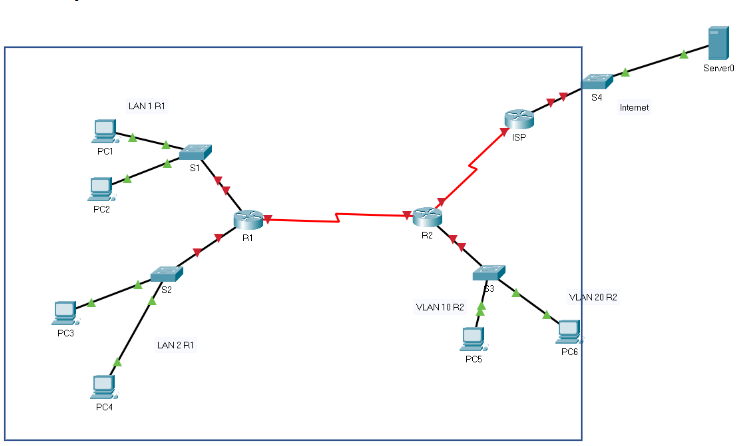

# Opgave Cisco Labo 2

## Opmerking:
Dit is de naar .md herwerkte opgave van labo 2 zoals beschikbaar in de [brochure](pdf/brochure-sep-2223.pdf). Hier en daar zijn aanpassingen doorgevoerd (omdat de simulatie in packet tracer niet steeds overeenkomt met de werkelijkheid). Deze aanpassingen zijn <del>doorstreept</del> en/of <ins>onderlijnd</ins>. Een uitgebreide versie van de opgave met ook alle uit te voeren instructies erbij is [hier](labo2_instructies.md) terug te vinden. Een versie met copypaste instructies per device, welke we zullen gebruiken tijdens de presentatie in week 10, is [hier](labo2_copypaste_instructies.md) te vinden.

## Gegeven:

### Volgende opstelling:

### Bijhorend .pkt bestand:
Gebruik de bijbehorende Packet Tracer file: <del>Opgave  DHCPv6  met  statische routesklaar voor configuratie.pkt (Zie Chamilo)</del>
<ins>
* Versie Packet Tracer: [opgave](pkt/labo2_00_chamilo.pkt)
* Versie netwerklokaal: [opgave](pkt/labo2_00_netwerklokaal.pkt)
</ins>

### Labo-opdracht:
Bouw  het  netwerk  binnen de kader uit. Vervang hierbij <ins>voor de versie in het netwerklokaal</ins> de interface naar het internet of dus Server0 door een loopback interface op de ISP-router <ins>met als ipv6 adres 2001:db8:1000::10</ins>.

## Opdracht:

### 1. Gebruik volgende netwerkadressen

| Groep        | LAN 1 R1/64    | LAN 2 R1/64    | VLAN 10 R2/64  | VLAN 20 R2/64  | Seriële link R1-R2/64     |
| :--          | :--            | :--            | :--            | :--            | :--               |
| Groep 1 TIAO | 2001:db8:A:2:: | 2001:db8:B:2:: | 2001:db8:C:2:: | 2001:db8:D:2:: | 2001:db8:ACDC:2:: |

### 2. R1  
<ol type="a">
  <li>Link local adres op alle interfaces = FE80::1</li>
  <li>Configureer alle interfaces eerst. Neem telkens als interface ID = 1, behalve S0/1/0</li>
  <li>G0/0/0 wordt geactiveerd voor SLAAC => PC1 en PC2 krijgen hun IPv6-adres via SLAAC</li>
  <li>Via G0/0/1 wordt R1 gebruikt als stateless DHCPv6-server:
  <ol type="i">
    <li>Domainname : SystemEngineeringProject</li>
    <li>DNS-server: 2001:db8:1000::10</li>
    <li>PC3 en PC4 krijgen hun IPv6-adres via de stateless DHCPv6-server</li>
  </ol>
  </li>
  <li>S0/1/0 is client van de statefulDHCPv6-server op R2.</li>
</ol>

### 3. R2:
<ol type="a">
  <li>Link local adres op alle interfaces = FE80::2</li>
  <li>Configureer alle interfaces eerst. Neem telkens als interface ID = 1.</li>
  <ol type="i">
    <li>Let op G0/0/0 bedient 2 VLAN’s.</li>
    <ol type="1">
      <li>Voorzie de nodige subinterfaces</li>
    </ol>
    <li>Voorzie intervlan-routing via router-on-a-stick</li>
  </ol>  
  <li>Via G0/0/0 en S0/1/0 wordt R2 geactiveerd als stateful DHCPv6 voor</li>
  <ol type="i">
    <li>VLAN 10 waarop PC5 zit (VLAN 10 zit op interfaces fa0/1-fa0/10)</li>
    <li>VLAN 20 waarop PC6 zit (VLAN 20 zit op interfaces fa0/11-fa0/20)</li>
    <li>Voor de seriële verbinding met R1, want R1 is client van dezestateful DHCPv6</li>
    <li>Domainname : SystemEngineeringProject</li>
    <li>DNS-server: 2001:db8:1000::10</li>
  </ol>
  </li>
  <strong>Tip voorzie voor elk netwerk een aparte DHCP-pool!</strong>
</ol>

### 4. Routering:
<ol type="a">
  <li>Voorzie op R1 een fully specified statische default route door gebruik te maken van het link-local adres vanR2</li>
  <li>Voorzie op R2:</li>
  <ol type="i">
    <li>2 directly connected standaard statische routes </li>
    <ol type="1">
      <li>1 naar netwerk van LAN 1 R1</li>
      <li>En 1 naar netwerk van LAN 2 R1</li>
    </ol>
    <li>Een next hop statische default route naar de ISP.</li>
  </ol>
  <li>Voorzie op de ISP-router 4 standaard statische routes (naar keuze) naar:</li>
  <ol type="i">
    <li>1 naar netwerk van LAN 1 R1</li>
    <li>1 naar netwerk van LAN 2 R1</li>
    <li>1 naar VLAN 10 R2</li>
    <li>1 naar VLAN 20 R2</li>
  </ol>
</ol>

### 5: Controle
Controleer of je op alle PC’s 
* <ins>In Packet Tracer:</ins> de webpagina: systemengineeringproject.org kan oproepen!
* <ins>In het netwerklokaal: de loopbackinterface op de ISP router (2001:db8:1000::10) kan pingen.</ins>