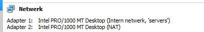

Het script gaat er van uit dat je virtualbox hebt geïnstalleerd op de default locatie! (Dit is belangrijk voor VboxGuestAdditions te automatiseren voor iedereen). Als dat niet het geval is zal je in ./Exchange.bat een wijziging van het pad moeten aanbrengen bij de vboxmanage unattended install --additions-iso lijn.

_Als het cd commando tijdens troubleshooting niet zou werken kan je het commando pushd gebruiken_

**Domaincontroller moet aanstaan tijdens het volledige proces !**

1. Voor het succesvol uitvoeren van de scripts moet je beschikken over volgende structuur:
   **_ Map Prerequisites _**
   ./Prerequisites -> Bevat Exchange_Installer.bat, Features_domain_1.ps1, Features_domain_2.ps1, Transfer_Execute.bat, ndp46-x86-x64-allos-enu.exe, rewrite_amd64_en-US.msi, vcredist_x64.exe
   De laatstgenoemde bestanden zijn te vinden via volgende URL's:
   info: https://learn.microsoft.com/en-us/exchange/plan-and-deploy/prerequisites?view=exchserver-2019

   Directe links naar bestanden die je nodig hebt:
   .NET Framework 4.8
   https://download.visualstudio.microsoft.com/download/pr/014120d7-d689-4305-befd-3cb711108212/0fd66638cde16859462a6243a4629a50/ndp48-x86-x64-allos-enu.exe

   Visual C++ 2013
   https://aka.ms/highdpimfc2013x64enu

   URL Rewrite Module
   https://download.microsoft.com/download/1/2/8/128E2E22-C1B9-44A4-BE2A-5859ED1D4592/rewrite_amd64_en-US.msi

   UCMARedist zit verwerkt in de ISO van exchange, deze hoeft dus niet op voorhand geïnstalleerd te worden. Het script navigeert naar exchange ISO om hem daar uit te halen

   **_ Map ISO _**
   ./ISO/ -> Bevat en_windows_server_2019_x64_dvd_4cb967d8.iso , ExchangeServer2019-x64-CU12.iso

   ./Exchange.bat
   ./transfer.bat

2. Download de benodigde ISO file (Windows Server 2019) van AcademicSoftware. Plaats deze in de ISO folder en verander de naam NIET
   ./ISO/en_windows_server_2019_x64_dvd_4cb967d8.iso
   => Mocht de naam toch anders zijn, kan je bovenstaande kopieren en het bestand hernoemen of het in het uitrolscript Exchange.bat aanpassen.

3. Run het bestand "Exchange.bat"
   => Dit bestand maakt een nieuwe virtuele machine aan en zorgt voor de juiste configuraties
   
   => Je moet na het uitvoeren van Exchange.bat zelf de exchangeserver ISO toevoegen bij SATA of IDE in het opslag tabje bij de eigenschappen van de VM. Dit werkt nog niet via het script.
   

4. Controleer of er nu een virtuele machine is aangemaakt in virtualbox. Vergelijk ook de eigenschappen van de VM met de variabelen uit het bestand "Exchange.bat" als je zeker wil zijn.
   -> thuis testen -> aanpassen van netwerkadapter naar NAT + intern network (ipv bridged network)
   

   Bij opstart van de machine wordt het installatieproces opgestart:
   

5. Wacht tot de VM klaar is met uitrollen en je een CMD prompt krijgt van C:\Users\Administrator>
   

6. Run het bestand "transfer.bat"
   => Dit bestand zal de prerequisites, bat files en powershell files overzetten naar de Exchange VM

   Ook hier is het een vereiste dat de PATH variabele gedeclareerd wordt, om aan te geven waar het VBoxManage-commando kan gevonden worden:

   

7. Navigeer naar de Downloads map. Gebruik "cd Downloads"
   => Gebruik even het Dir commando om te controleren of de files overgezet zijn.
   

   Herstart de machine (shutdown /r), zoniet zal de volgende stap mislukken

8. Run het Features_domain_1.ps1 bestand met het commando "powershell .\Features_domain_1.ps1"

   Na het runnen van dit script wordt de melding gegeven dat een restart nodig is:
   .

   Echter, na herstart, blijft deze foutmelding.
   We trachten eerst het commando uit stap 9 te runnen.
   Eenmaal deze stap achter de rug (incl. reboot uit stap 10), het powershell-script Features_domain_1 nogmaals laten runnen, deze keer met succes:
   

9. Run het Transfer_Execute.bat bestand met het commando ".\Transfer_Execute.bat"
   Aandacht: door de restarts is het mogelijk dat de Exchange-ISO uit de VM geworpen is!
   Controleer dit in VirtualBox en laad deze indien nodig opnieuw, deze moet in de E-drive terechtkomen (zie einde stap 3)!

   Als de ISO gevonden is, werkt deze stap:
   

10. Reboot

11. Navigeer terug naar Downloads met het commando "cd downloads"

12. Controleer of je de domaincontroller kan pingen en omgekeerd 192.168.20.3 <=> 192.168.20.1
      Deze stap werkte in eerste instantie niet.
      Oorzaak: Neo stond geconfigureerd in Intern Netwerk "servers", terwijl AgentSmith deel uitmaakte van Intern Netwerk "intnet". Deze laatste manueel aangepast naar "servers". De ping-pogingen werken nu wel:
      

13. Run het Features_domain_2.ps1 bestand met het commando "powershell .\Features_domain_2.ps1"
      

14. Reboot het systeem

15. Gebruik nu rechtercontrol + delete om van gebruiker te veranderen en log in als THEMATRIX\Administrator met het wachtwoord 22Admin23
    => rctrl + del => switch user => other user => THEMATRIX\Administrator + 22Admin23
         
    => Als je op switch user klikt zal hij meteen een wachtwoord vragen. Dit is echter weer het lokale administrator account. Druk op ESC om als een nieuwe gebruiker in te loggen.

16. Je prompt zou nu moeten aangepast zijn naar C:\Users\Administrator.THEMATRIX>
      OK.
      Er wordt wel terug een switch naar QWERTY keyboard layout gedaan.
      Om dit terug te brengen naar Belgische layout:
      

17. Navigeer terug naar de downloads map maar van de administrator gebruiker met het commando "cd C:\Users\Administrator\Downloads"

18. Run het Exchange_Installer.bat bestand
    => Als deze abrupt afsluit kan je de logs controller in C:\ExchangeSetupLogs\Exchangeserver.log
    => Hoogstwaarschijnlijk moet je enkel een recoverserver uitvoeren. Dit kan je doen met het volgende commando: "E:\setup.exe /Iacceptexchangeserverlicenseterms_diagnosticdataOFF /mode:recoverserver

19. Laat de Exchange server installeren. Dit kan zeer lang duren (45+ minuten). Ik raad aan om elke 5-10 minuten eens te enteren in het geval dat de installer vast zit. Dit merk je op als het percentage te lang op hetzelfde blijft hangen.

20. Reboot de server volledig

21. Je kan nu op een client die verbonden is met het domein de mailbox configureren door het IP van de exchange server gevolgd door /ecp in te geven.
    Voorbeeld: Https://192.168.20.3/ecp

22. Je kan nu op een client die verbonden is met het domein de mailbox bereiken door het IP van de exchange server gevolgd door /owa in te geven.
    Voorbeeld: Https://192.168.20.3/OWA
