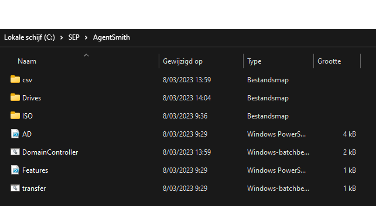
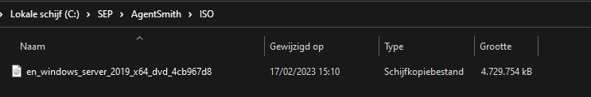
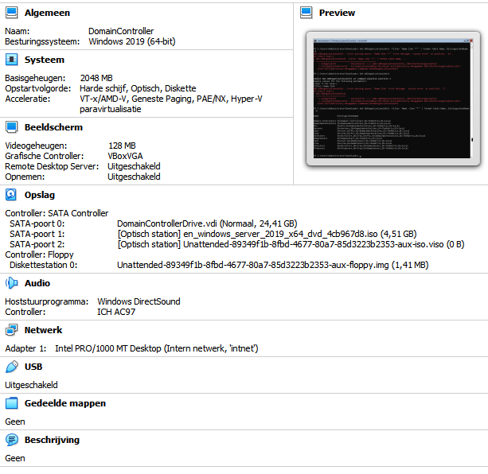
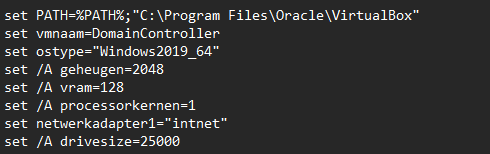
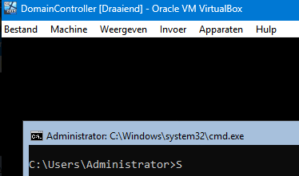
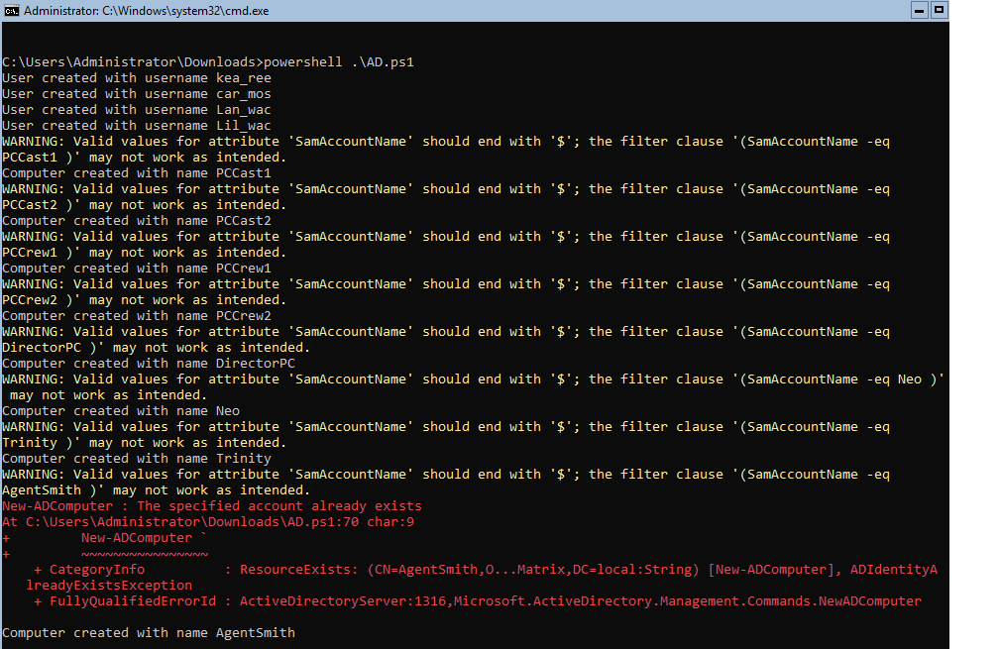
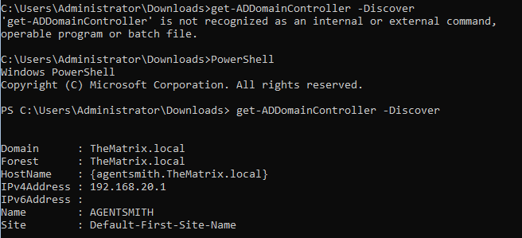
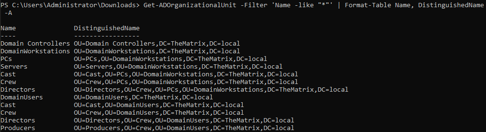

# Testrapport Opdracht 1: Installatie van de Domain controller

## Test 1

Uitvoerder(s) test: Wim Meirlaen
Uitgevoerd op: 08/03/2023
Github commit:  COMMIT HASH

Het script gaat er van uit dat je virtualbox hebt geïnstalleerd op de default locatie! (Dit is belangrijk voor VboxGuestAdditions te automatiseren voor iedereen). Als dat niet het geval is zal je in ./Domaincontroller.bat een wijziging van het pad moeten aanbrengen bij de vboxmanage unattended install --additions-iso lijn.

1. Voor het succesvol uitvoeren van de scripts moet je beschikken over volgende structuur:
    ./csv/
    ./Drives/
    ./ISO/
    ./Features.ps1
    ./AD.ps1
    ./Domaincontroller.bat
    ./transfer.bat

    Aan deze behoefte werd voldaan onder directory C:\SEP\AgentSmith\ :

    

2. Download de benodigde ISO file (Windows Server 2019) van AcademicSoftware. Plaats deze in de ISO folder en verander de naam NIET
    ./ISO/en_windows_server_2019_x64_dvd_4cb967d8.iso

    

3. Run het bestand "DomainController.bat"
    => Dit bestand maakt een nieuwe virtuele machine aan en zorgt voor de juiste configuraties

    *** Resultaat ***
    Deze stap slaagt, mits toevoegen van een PATH-variabele aan het script die weergeeft waar VMBoxManage gedefinieerd is. 

4. Controleer of er nu een virtuele machine is aangemaakt in virtualbox. Vergelijk ook de eigenschappen van de VM met de variabelen uit het bestand "DomainController.bat" als je zeker wil zijn.

*** Resultaat ***
De machine werd succesvol aangemaakt in VirtualBox:

We zien dat de eigenschappen zoals meegegeven in DomainController.bat overeenkomen:

5. Wacht tot de VM klaar is met uitrollen en je een CMD prompt krijgt van C:\Users\Administrator>

6. Run het bestand "Transfer.bat"
    => Dit bestand zal de csv file en powershell files overzetten naar de DomainController VM
    => Na het overzetten zal automatisch de installatie van DNS, AD en DC gebeuren
    => Herstart het systeem nadat de DomainController geïnstalleerd is (Shutdown /r)

*** Resultaat ***
Ook deze stap slaagt mits toevoegen van de PATH-variabele aan dit script (zie ook punt 3)

7. Wacht tot de DomainController klaar is met "Applying User Settings" (Dit kan lang duren, > 5 minuten in sommige gevallen!)

8. Voer volgende reeks commandos uit in de cmd prompt:
    => cd Downloads
    => powershell .\AD.ps1

    

9. Voer enkele controles uit om te zien of de features correct geïnstalleerd zijn
    Get-ADDomainController -Discover
    Get-ADOrganizationalUnit -Filter 'Name -like "*"' | Format-Table Name, DistinguishedName -A
    
    (start eerst een PowerShell op)

    
    
    

