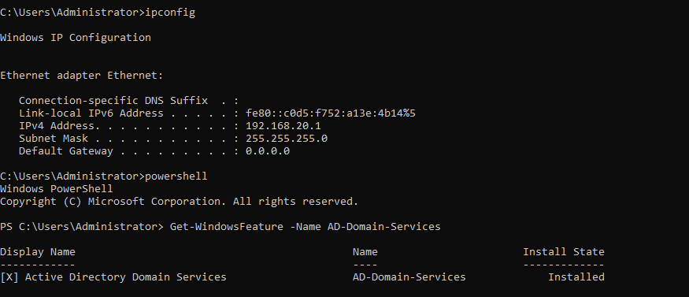
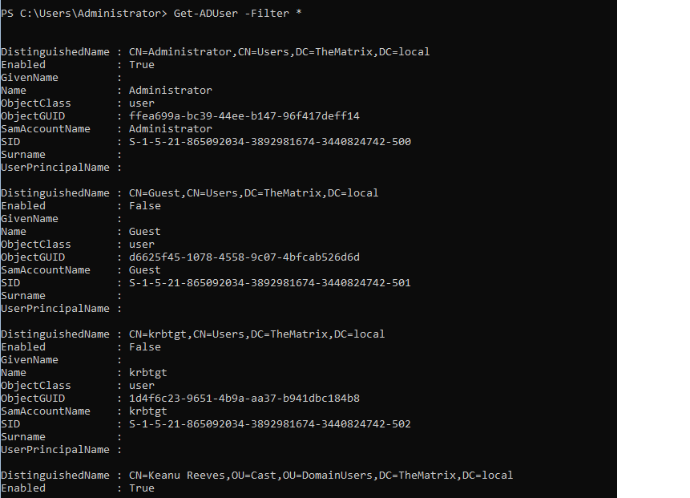

# Testrapport Opdracht 1: Active Directory Domain Services 

(Een testrapport is het verslag van de uitvoering van het testplan door een teamlid (iemand anders dan de auteur van het testplan!). Deze noteert bij elke stap in het testplan of het bekomen resultaat overeenstemt met wat verwacht werd. Indien niet, dan is het belangrijk om gedetailleerd op te geven wat er misloopt, wat het effectieve resultaat was, welke foutboodschappen gegenereerd werden, enz. De tester kan meteen een Github issue aanmaken en er vanuit het testrapport naar verwijzen. Wanneer het probleem opgelost werdt, wordt een nieuwe test uitgevoerd, met een nieuw verslag.)

## Test 1 AgentSmith AD

Uitvoerder(s) test: Wim Meirlaen
Uitgevoerd op: 14-03-2023
Github commit:  COMMIT HASH


1. Login to the server 
2. Execute the following command:
```powershell
    Get-WindowsFeature -Name AD-Domain-Services
```
*Resultaat* 
De feature heeft de status geïnstalleerd:


3. Get the list of AD-users from the server:
```
Get-ADUser -Filter *
```
4. Get the list of Organizational Units from the server:


