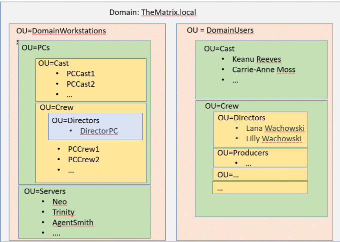

# Opgave 3.3: Domain Controller

## Opmerking:

* Ten opzichte van de originele opgave uit de [originele brochure](../documentatie/pdf/brochure-sep-2223.pdf) zijn enkele wijzigingen aangebracht. Deze wijzigingen zijn <del>doorstreept</del> en/of <ins>onderlijnd</ins>, met de reden/verantwoording van wijziging erbij in <strong>vet</strong>.
* De onderdelen uit Opdracht 3.1 Algemeen die van toepassing zijn voor deze opgave zijn ook toegevoegd
* Dit resulteert onderaan dit document in een herwerkte opgave.
* Deze opgave vormt de bron voor de deliverables welke worden beschreven in het lastenboek en daarna getest met het testplan.

## Opgave

* <ins>Het domein zal de volgende naam hebben: “thematrix.local”.</ins>
 <strong>Deliverable uit opgave 3.1 Algemeen</strong>

* <ins>Leg eerst en vooral een IP-adrestabel vast voor alle componenten in het netwerk die dit nodig hebben => Voorzie agentsmith van een correct vast IPv4-adres, subnetmask en default gateway.<ins>
 <strong>Deliverable uit opgave 3.1 Algemeen</strong>

* <ins>Installatie en configuratie van de Windows systemen gebeurt deels in de GUI en deels aan de hand van PowerShell scripts</ins>
 <strong>Deliverable uit opgave 3.1 Algemeen</strong>

* <ins>Zorg ervoor dat alle scripts herbruikbaar zijn (m.b.v. variabelen).</ins>
 <strong>Deliverable uit opgave 3.1 Algemeen</strong>

* <ins>Schrijf testplannen met excacte procedures die toelaten te valideren of een deeltaak is uitgevoerd volgens de specificaties.</ins>
 <strong>Deliverable uit opgave 3.1 Algemeen</strong>

* <ins>Een ander teamlid volgt de instructies van de testplannen en schrijft een testrapport over het resultaat.</ins>
 <strong>Deliverable uit opgave 3.1 Algemeen</strong>

* Hostnaam: “agentsmith"

* OS: Windows Server 2019(zonder GUI, enkel CLI).

* Implementeer volgende domainstructuur automatisch via een powershellscript:

* Importeer meteen powershellscriptook enkele acteurs, crewleden en minstens 2 PC’s in elke OU vanuit een CSV-file.

* Zorg ervoor dat je de servers via RSAT kan configureren vanop de DirectorPC (Windows 10).

* Pc’s en servers hebben geen eigen <ins>gewone</ins> gebruikers, authenticatie gebeurt telkens via de Domain Controller. 
 <strong>We laten enkel de lokale 'Administrator' gebruiker nog bestaan als back-up. Deze zou in principe kunnen worden disabled, maar dit is buiten de scope van dit project</strong>

* Zorg ervoor dat de cast enkel kan inloggen in de cast-Pc’s, de crew enkel op de crew-Pc’s. Directors kunnen overal inloggen.

* Elke user krijgt automatisch zijn eigen persoonlijke shared folder.

* Voorzie ook een shared folder voor zowel de cast als de crew en creëer groepen om de toegang tot die shared folders te regelen.

* Werk volgende beleidsregels uit op gebruikersniveau:
  * Verbied iedereen behalve de directors de toegang tot het control panel
  * Zorg ervoor dat niemand werkbalken (toolbars)kan toevoegen aan de taakbalk
  * Verbied iedereen van de cast de toegang tot de eigenschappen van de netwerkadapters.
 
* Deze server zal ook de rol van DNS-server vervullen:
  * Hij beantwoordt alle queries binnen het domein “thematrix.local”.
  * Queries voor andere domeinen worden geforward naar een geschikte DNS-server.
  * Voor elke host binnen het domein zijn er A (IPv4), AAAA (IPv6) en PTR (IPv4 en(!)IPv6) records voorzien, in de gepaste zonebestanden.
  * Voorzie voor elke host geschikte CNAME-recordsom de functie van een server aan te duiden (bv. www, imap, smtp, ...).
  * Voorzie waar nuttig/nodig ook andere records (bv. NS, MX, SRV, ...)

## Herwerkte opgave

* Het domein zal de volgende naam hebben: “thematrix.local”.
* Voorzie agentsmith van een correct vast IPv4-adres, subnetmask en default gateway volgens de IP-adrestabel.
* Installatie en configuratie van de Windows systemen gebeurt deels in de GUI en deels aan de hand van PowerShell scripts
* Zorg ervoor dat alle scripts herbruikbaar zijn (m.b.v. variabelen).
* Schrijf testplannen met excacte procedures die toelaten te valideren of een deeltaak is uitgevoerd volgens de specificaties.
* Een ander teamlid volgt de instructies van de testplannen en schrijft een testrapport over het resultaat.
* Hostnaam: “agentsmith"
* OS: Windows Server 2019(zonder GUI, enkel CLI).
* Implementeer volgende domainstructuur automatisch via een powershellscript:

* Importeer meteen powershellscriptook enkele acteurs, crewleden en minstens 2 PC’s in elke OU vanuit een CSV-file.
* Zorg ervoor dat je de servers via RSAT kan configureren vanop de DirectorPC (Windows 10).
* Pc’s en servers hebben geen eigen gewone gebruikers, authenticatie gebeurt telkens via de Domain Controller. 
* Zorg ervoor dat de cast enkel kan inloggen in de cast-Pc’s, de crew enkel op de crew-Pc’s. Directors kunnen overal inloggen.
* Elke user krijgt automatisch zijn eigen persoonlijke shared folder.
* Voorzie ook een shared folder voor zowel de cast als de crew en creëer groepen om de toegang tot die shared folders te regelen.
* Werk volgende beleidsregels uit op gebruikersniveau:
  * Verbied iedereen behalve de directors de toegang tot het control panel
  * Zorg ervoor dat niemand werkbalken (toolbars)kan toevoegen aan de taakbalk
  * Verbied iedereen van de cast de toegang tot de eigenschappen van de netwerkadapters.
* Deze server zal ook de rol van DNS-server vervullen:
  * Hij beantwoordt alle queries binnen het domein “thematrix.local”.
  * Queries voor andere domeinen worden geforward naar een geschikte DNS-server.
  * Voor elke host binnen het domein zijn er A (IPv4), AAAA (IPv6) en PTR (IPv4 en(!)IPv6) records voorzien, in de gepaste zonebestanden.
  * Voorzie voor elke host geschikte CNAME-recordsom de functie van een server aan te duiden (bv. www, imap, smtp, ...).
  * Voorzie waar nuttig/nodig ook andere records (bv. NS, MX, SRV, ...)

