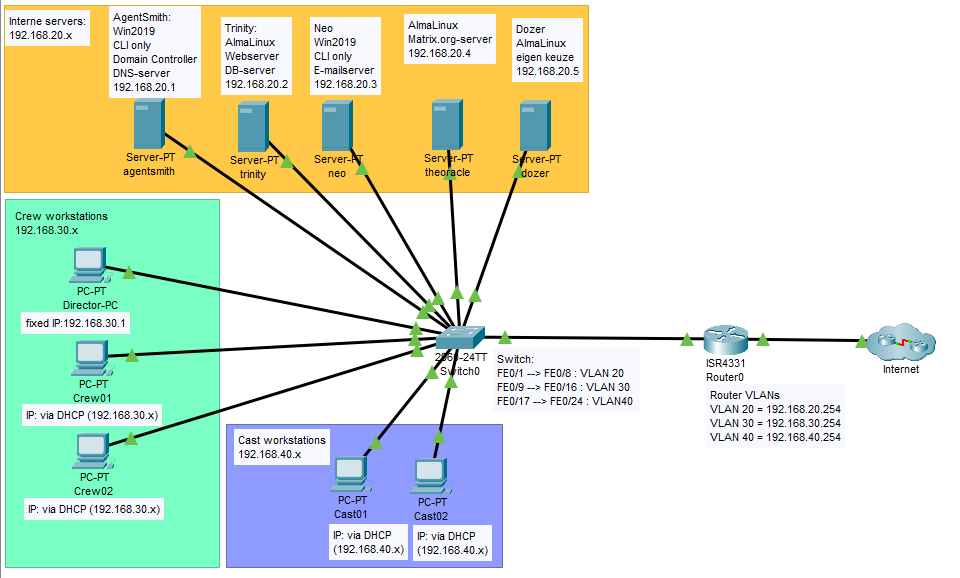

# Documentatie Opdracht 3.2: Netwerk

- Dit is een overzicht met alle nodige gegevens om het netwerk op te bouwen of de werking ervan te controleren
- De virtuele machines draaien in VirtualBox (bridged mode) op verschillende laptops 
- Op de servers worden via scripts de netwerkinstellingen geïmplementeerd
- De workstations krijgen de netwerkinstellingen via DHCP van de router
- Verbieden internet toegang voor Cast wordt m.b.v. ACL op de router geïmplementeerd
- De configuratie van router en switch is te vinden in de [instructies](netwerk_instructies.md)

## Domein
- thematrix.local

## DNS
- Alle interne servers en computers gebruiken de Domain Controller agentsmith als DNS-server: 192.168.20.1
- 8.8.8.8 en 8.8.4.4 zijn geïmplementeerd als backup om rapper online te raken, ook met de guest operating systems ...

## Interne Netwerken
| **Network address / CIDR** | **CIDR** | **Subnet mask** | **Gateway**    |
| -------------------------- | :------: | :-------------- | :------------- |
| 192.168.20.0/24            | /24      | 255.255.255.0   | 192.168.20.254 |
| 192.168.30.0/24            | /24      | 255.255.255.0   | 192.168.30.254 |
| 192.168.40.0/24            | /24      | 255.255.255.0   | 192.168.40.254 |

## Internet
* Verkregen via DHCP van HoGent op G0/0/1 van de Router. Via NAT overloading aan de interne netwerken verder verdeeld.
* Op VLAN 40 beperkt tot de Host, geen toegang voor de VM's (NAT enkel voor 128 en hogere hosts)

## Vaste IP-adressen
| **host**        | **ip**          |
| :-------------- | :-------------- |
| agentsmith      | 192.168.20.1    |
| trinty          | 192.168.20.2    |
| neo             | 192.168.20.3    |
| theoracle       | 192.168.20.4    |
| dozer           | 192.168.20.5    |
| tank            | 192.168.20.6    |
| cypher          | 192.168.20.7    |

## VLAN tabel
| **VLAN ID** | **Naam**  | **Poorten** | **virtuele machines**                                   |
| :---------- | :-------- | :---------- | :------------------------------------------------------ |
| 20          | SERVERS   | F0/1-8      | agentsmith, trinty, neo, theoracle, dozer               |
| 30          | CREW      | F0/9-16     | DirectorPC, PCCrew1, PCCrew2, ...                       |
| 40          | CAST      | F0/17-24    | PCCast1, PCCast2, ...                                   |

## Topologie

Ter visuele ondersteuning werd de topologie voor dit netwerk opgemaakt in Packet Tracer.
Het specifieke .pkt-bestand is terug te vinden op de GIT-repository van dit project.

## VirtualBox

| **PC**     | **VM**     | **VLAN** | 
| :--------- | :--------- | :------- |
| FLAB2021   | agentsmith | 20       |
| Naoufal    | trinity    | 20       |     
| Lukas      | neo        | 20       |     
| Olivier    | theoracle  | 20       |     
| Stein      | dozer      | 20       |     
| FLABTOP    | DirectorPc | 30       |     
| FLABTOP    | PCCrew1    | 30       |     
| FLABWERK   | PCCast1    | 30       |     
| FLABWERK   | PCCast2    | 30       |

## Deliverables
Hoe werden ze bereikt?

* Domein = <strong>thematrix.local</strong>
  * In de dhcp pool van de routers wordt thematrix.local als domain-name meegegeven
  * Als domain name meegegeven aan de domain controller bij het opzetten van de forest en in dns opgenomen

* IP-adrestabel voor alle componenten, verdeeld in subnetten
  * Voor de eenvoud worden de subnetten /24 gehouden. Wegens het werken met NAT is het compleet nutteloos deze nog verder in te perken gewoon om te demonstreren dat we het nut van inperken van publiek ip-adressen en VLSM -hier dus niet van toepassing- snappen. Bovendien kan zo de default gateway overal makkelijk op .254 gehouden worden en komen de nummers van de subnetten ook mooi overeen met die van de VLAN's. KIS.

* Het netwerk en alle servers worden (enkel) uitgewerkt met IPv4
  * IPv6 is enkel beschikbaar als lookup zone in de DNS
  * IPv4 adress van servers worden vast toegekend, de workstations (en hosts) krijgen een dynamisch IPv4 adres van de router

* De opstelling wordt uitgevoerd met virtuele machines en in het netwerklokaal aanwezige apparatuur
  * Voor een verdeling van VM's, zie hoger : Virtualbox
  * Zie instructies voor instellingen van apparatuur: 1 Switch en 1 Router

* Gebruik VLAN's cfr. de [opgave](netwerk_opgave.md)
  * 8 FastEthernet poorten per VLAN op de switch geconfigureerd

* Inter-VLAN routing via router-on-a-stick configuratie
  * 1 Gigabit poort naar de router als trunk 

* Internettoegang via NAT
  * Het van HoGent verkregen IP-adres wordt via NAT overloading gedeeld

* Restricties m.b.v. ACL
  * Restricities voor toegelaten NAT (enkel de voorzien VLAN's) aanwezig op de router
  * Restrictie internettoegang zal een last minute implementatie worden (gewoon niet toegelaten tot NAT)

* Simulatie m.b.v Packet Tracer
  * Beschikbaar in github als naslagwerk, maar wegens verschillen met echte devices weinig relevant.
  * Eens we een werkende echte setup hadden bleek dit .pkt-bestand geen meerwaarde meer te zijn.

* Testplan met exacte procedures
  * zie [testplan](netwerk_testplan.md)

* Testrapport
  * de demo zal de facto ons (mondeling) [testrapport](netwerk_testrapport.md) zijn voor de meeste zaken welke zonder echte apparatuur (als afstandsstudent) moelijk konden worden getest

* Demo op 25/5/2023: De opstelling lokaal uitvoeren met virtuele machines (op de laptops van de studenten) en de aanwezige apparatuur in het netwerklokaal
  * Configuratie van Router en Switch volgens de instructies gebeuren als eerste voor al de rest, kwestie dat iedereen over deze setup het internet kan bereiken en niet met een combinatie van WiFi en LAN moet worden gewerkt. Twee PuTTY verbindingen zullen daartoe openstaan op FLAB2021. Daar kunnen ook de ip dhcp bindings en nat vertalingen worden getest tijdens de demo.
