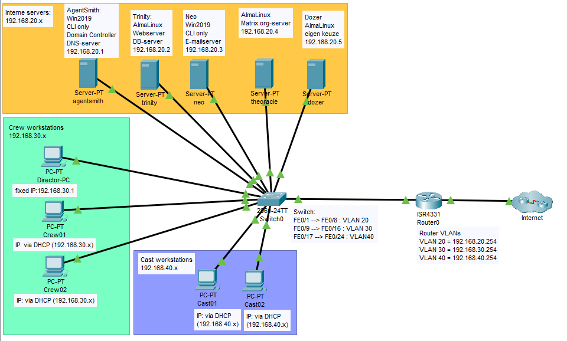

# Instructies Opgave 3.2: Netwerk

## Opmerking:

- Deze instructies bevatten alle uit te voeren instructies per device.
- Er wordt in deze instructies van uit gegaan dat de uitvoerder reeds enige ervaring heeft met de fysieke devices en basic troubleshooten kan uitvoeren.
- Op switches en routers werden geen paswoorden ingesteld (skill reeds getest tijdens de labo's en hier contraproductief)
- Simulatie werd uitgevoerd in dit [bestand](pkt/thematrix.pkt)
- De devices zijn aangeschakeld en de bekabeling is correct aangebracht volgens de onderstaande tabel/topologie:



## Instructies

### Bekabeling netwerklokaal

- (\*): dubbele vermelding, verbinding zou er reeds moeten zijn indien onderstaande tabel in volgorde wordt afgelopen:

| Device    | Van            | Device                | Naar   | Kabel    |
| :-------: | :------------: | :-------------------- | :----: | :------: |
| S-T01     | console achter | patchpaneel           | 12.16  | UTP      |
| S-T01     | G0/1           | R-T01                 | G0/0/0 | UTP      |
| S-T01     | F0/1           | patchpaneel           | 12.10  | UTP      |
| S-T01     | F0/2           | patchpaneel           | 11.10  | UTP      |
| S-T01     | F0/3           | patchpaneel           | 10.10  | UTP      |
| S-T01     | F0/4           | patchpaneel           | 9.10   | UTP      |
| S-T01     | F0/5           | patchpaneel           | 8.10   | UTP      |
| S-T01     | F0/9           | patchpaneel           | 7.10   | UTP      |
| S-T01     | F0/17          | patchpaneel           | 7.11   | UTP      |
| R-T01     | console voor   | patchpaneel           | 12.15  | UTP      |
| R-T01     | G0/0/0         | S-T01                 | G0/1   | UTP (\*) |
| R-T01     | G0/0/1         | patchpaneel           | 12.6   | UTP      |
| eiland 7  | 7.10           | **Benny (FLABTOP)**   | NIC    | UTP      |
| eiland 7  | 7.11           | **Benny (FLABWERK)**  | NIC    | UTP      |
| eiland 8  | 8.10           | **Stein**             | NIC    | UTP      |
| eiland 9  | 9.10           | **Olivier**           | NIC    | UTP      |
| eiland 10 | 10.10          | **Lukas**             | NIC    | UTP      |
| eiland 11 | 11.10          | **Nafoual**           | NIC    | UTP      |
| eiland 12 | 12.1           | eiland 12             | 12.6   | UTP      |
| eiland 12 | 12.6           | eiland 12             | 12.1   | UTP (\*) |
| eiland 12 | 12.10          | **Benny (FLAB2021)**  | NIC    | UTP      |
| eiland 12 | 12.15          | **Benny (FLAB2021)**  | USB    | console  |
| eiland 12 | 12.16          | **Benny (FLAB2021)**  | USB    | console  |

### S-T01
- Bekabeling:
  - S-T01 console achter > UTP > patchpaneel 12.16 > eiland 12.16 > console > USB Benny
  - S-T01 G0/1 > UTP > R-T01 G0/0/0
  - S-T01 F0/1 > UTP > patchpaneel 12.10 > eiland 12.10 > NIC Benny (FLAB2021) > vm agentsmith
  - S-T01 F0/2 > UTP > patchpaneel 11.10 > eiland 11.10 > NIC Nafoual > vm trinity
  - S-T01 F0/3 > UTP > patchpaneel 10.10 > eiland 10.10 > NIC Lukas > vm neo
  - S-T01 F0/4 > UTP > patchpaneel 9.10 > eiland 9.10 > NIC Olivier > vm theoracle
  - S-T01 F0/5 > UTP > patchpaneel 8.10 > eiland 8.10 > NIC Stein > vm dozer
  - S-T01 F0/9 > UTP > patchpaneel 7.10 > eiland 7.10 > NIC Benny (FLABTOP) > vm DirectorPC, PCCrew1
  - S-T01 F0/17 > UTP > patchpaneel 7.11 > eiland 7.11 > NIC Benny (FLABWERK) > vm PCCast1, PCCast2

- Controle of opkuisen en initialiseren nodig is:

```code
enable
show vlan brief
show run
```

- Opkuisen indien nodig:

```code
enable
delete vlan.dat
vlan.dat
y
erase startup-config
y
reload
y

```

- Instructies (in blokken):

```code
enable
configure terminal
hostname S-T01
vlan 20
name SERVERS
exit
vlan 30
name CREW
exit
vlan 40
name CAST
exit
vlan 666
name DISABLED
exit

```
```code
interface g0/1
switchport mode trunk
exit

```
```code
interface g0/2
switchport mode access
switchport access vlan 666
shutdown
exit

```
```code
interface range f0/1-8
switchport mode access
switchport access vlan 20
exit

```
```code
interface range f0/9-16
switchport mode access
switchport access vlan 30
exit

```
```code
interface range f0/17-24
switchport mode access
switchport access vlan 40
end
```

- indien noodzakelijk:

```code
copy running-config startup-config
startup-config
reload
y

```

- controle:

```code
show interfaces trunk
show vlan brief
```

- Na de demo:

```code
enable
delete vlan.dat
vlan.dat
y
erase startup-config
y
reload
y

```

### R-T01
- Bekabeling:
  - R-T01 console voor > UTP > patchpaneel 12.15 > eiland 12.15 > console > USB Benny (FLAB2021)
  - R-T01 G0/0/0 > UTP > S-T01 G0/1
  - R-T01 G0/0/1 > UTP > patchpaneel 12.6 > eiland 12.6 > eiland 12.1 > HOGENT (Internet)

- Controle of opkuisen en initialiseren nodig is:

```code
enable
show run
```

- opkuisen indien nodig:

```code
enable
erase startup-config
y
reload
y

```

- instructies (in blokken):

```code
enable
configure terminal
hostname R1-T01
ip domain lookup
ip dhcp excluded-address 192.168.20.1 192.168.20.100
ip dhcp excluded-address 192.168.20.206 192.168.20.254
ip dhcp excluded-address 192.168.30.1 192.168.30.100
ip dhcp excluded-address 192.168.30.202 192.168.30.254
ip dhcp excluded-address 192.168.40.1 192.168.40.100
ip dhcp excluded-address 192.168.40.202 192.168.40.254
ip dhcp pool TWINTIG
network 192.168.20.0 255.255.255.0
domain-name thematrix.local
dns-server 192.168.20.1 8.8.8.8
default-router 192.168.20.254
exit
ip dhcp pool DERTIG
network 192.168.30.0 255.255.255.0
domain-name thematrix.local
dns-server 192.168.20.1 8.8.4.4
default-router 192.168.30.254
exit
ip dhcp pool VEERTIG
network 192.168.40.0 255.255.255.0
domain-name thematrix.local
dns-server 192.168.20.1 8.8.4.4
default-router 192.168.40.254
exit
ip dhcp pool STATIC_20_FLAB2021
host 192.168.20.201 255.255.255.0
client-identifier 017c.c2c6.44be.b4
exit
ip dhcp pool STATIC_20_NAFOUAL
host 192.168.20.202 255.255.255.0
client-identifier 0130.9C23.8F16.C9
exit
ip dhcp pool STATIC_20_LUKAS
host 192.168.20.203 255.255.255.0
client-identifier 0198.fa9b.d053.00
exit
ip dhcp pool STATIC_20_OLIVIER
host 192.168.20.204 255.255.255.0
client-identifier 0100.2B67.9837.D3
exit
ip dhcp pool STATIC_20_STEIN
host 192.168.20.205 255.255.255.0
client-identifier 0154.ab3a.9bea.a2
exit
ip dhcp pool STATIC_20_FLABTOP
host 192.168.30.201 255.255.255.0
client-identifier 0180.fa5b.5afa.86
exit
ip dhcp pool STATIC_20_FLABWERK
host 192.168.40.201 255.255.255.0
client-identifier 0154.ee75.896e.d7
exit

```
```code
interface GigabitEthernet0/0/0
description trunk naar SWITCH
no shutdown
exit

```
```code
interface GigabitEthernet0/0/0.20
description link naar SWITCH VLAN 20
encapsulation dot1Q 20
ip address 192.168.20.254 255.255.255.0
ip nat inside
exit

```
```code
interface GigabitEthernet0/0/0.30
description link naar SWITCH VLAN 30
encapsulation dot1Q 30
ip address 192.168.30.254 255.255.255.0
ip nat inside
exit

```
```code
interface GigabitEthernet0/0/0.40
description link naar SWITCH VLAN 40
encapsulation dot1Q 40
ip address 192.168.40.254 255.255.255.0
ip nat inside
exit

```
```code
interface GigabitEthernet0/0/1
description link naar HOGENT
ip address dhcp
ip nat outside
no shutdown
exit

```
```code
ip nat inside source list 1 interface GigabitEthernet0/0/1 overload
ip route 0.0.0.0 0.0.0.0 GigabitEthernet0/0/1
access-list 1 permit 192.168.20.0 0.0.0.255
access-list 1 permit 192.168.30.0 0.0.0.255
access-list 1 permit 192.168.40.128 0.0.0.127
end

```

- indien noodzakelijk:

```code
copy running-config startup-config
startup-config
reload
y

```

- controle:

```code
show run
show ip int brief
show ip dhcp pool
show ip dhcp binding
show ip nat statistics
show ip nat translations
show access-lists
show ip route

```

- Na de demo:

```code
erase startup-config
y
reload

```

### Benny (FLAB2021)
- Bekabeling:
  - S-T01 console achter > UTP > patchpaneel 12.16 > eiland 12.16 > console > USB Benny (FLAB2021)
  - R-T01 console voor > UTP > patchpaneel 12.15 > eiland 12.15 > console > USB Benny (FLAB2021)
  - S-T01 F0/1 > UTP > patchpaneel 12.10 > eiland 12.10 > NIC Benny (FLAB2021) > vm agentsmith
- IPv4 via DHCP:
  - IP: 192.168.20.201
  - DG: 192.168.20.254
  - DNS: 192.168.20.1, 8.8.8.8
  - Suffix: thematrix.local

### Nafoaul
- Bekabeling:
  - S-T01 F0/2 > UTP > patchpaneel 11.10 > eiland 11.10 > NIC Nafoaul > vm trinity
- IPv4 via DHCP:
  - IP: 192.168.20.202
  - DG: 192.168.20.254
  - DNS: 192.168.20.1, 8.8.8.8
  - Suffix: thematrix.local

### Lukas
- Bekabeling:
  - S-T01 F0/3 > UTP > patchpaneel 10.10 > eiland 10.10 > NIC Lukas > vm neo
- IPv4 via DHCP:
  - IP: 192.168.20.203
  - DG: 192.168.20.254
  - DNS: 192.168.20.1, 8.8.8.8
  - Suffix: thematrix.local

### Olivier
- Bekabeling:
  - S-T01 F0/4 > UTP > patchpaneel 9.10 > eiland 9.10 > NIC Olivier > vm theoracle
- IPv4 via DHCP:
  - IP: 192.168.20.204
  - DG: 192.168.20.254
  - DNS: 192.168.20.1, 8.8.8.8
  - Suffix: thematrix.local

### Stein
- Bekabeling:
  - S-T01 F0/5 > UTP > patchpaneel 8.10 > eiland 8.10 > NIC Stein > vm dozer
- IPv4 via DHCP:
  - IP: 192.168.20.205
  - DG: 192.168.20.254
  - DNS: 192.168.20.1, 8.8.8.8
  - Suffix: thematrix.local

### Benny (FLABTOP)
- Bekabeling:
  - S-T01 F0/9 > UTP > patchpaneel 7.10 > eiland 7.10 > NIC Benny (FLAB2021) > vm DirectorPC, PCCrew1
- IPv4 via DHCP:
  - IP: 192.168.30.201
  - DG: 192.168.30.254
  - DNS: 192.168.20.1, 8.8.4.4
  - Suffix: thematrix.local

### Benny (FLABWERK)
- Bekabeling:
  - S-T01 F0/17 > UTP > patchpaneel 7.11 > eiland 7.11 > NIC Benny (FLABWERK) > vm PCCast1, PCCast2
- IPv4 via DHCP:
  - IP: 192.168.40.201
  - DG: 192.168.40.254
  - DNS: 192.168.20.1, 8.8.4.4
  - Suffix: thematrix.local
