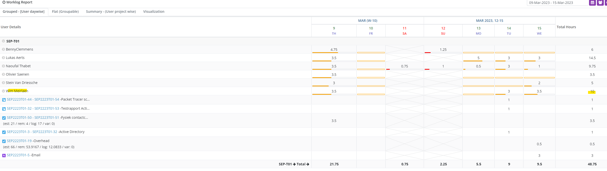
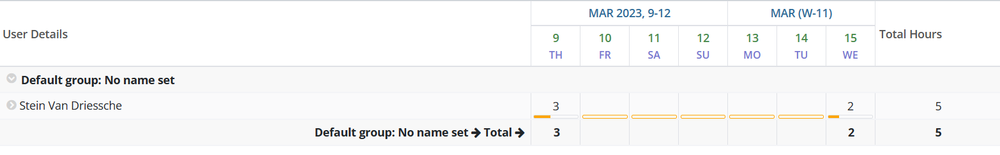
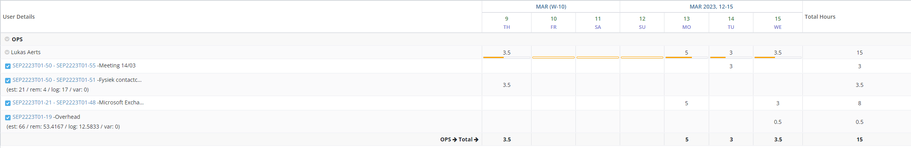

# Voortgangsrapport week 05

- Groep: T01
- Periode : donderdag 9 Maart - woensdag 15 Maart middernacht
- Datum voortgangsgesprek: 16-03-2023, 18:20 - 18-40 via MsTeams met Dhr. Labijn

| Student             | Aanw. | Opmerking |
| :------------------ | :---- | :-------- |
| Naoufal Thabet      | V     |           |
| Wim Meirlaen        | V     |           |
| Stein Van Driessche | V     |           |
| Lukas Aerts         | V     |           |
| Benny Clemmens      | V     |           |
| Olivier Saenen      | V     |           |

## Wat heb je deze week gerealiseerd?

- Meeting omtrent het gebruik van adressen, ons netwerk en de Exchange server
- Bespreken en testen van de bestaande scripts en bugs/foutjes wegwerken
- In Packet Tracer uitwerken van de netwerken (netwerkplan) van ons project
- Begin van uitwerking van het Exchange-gedeelte (opzet GUI en configuratie)
- Uitwerken en finetunen van wat er tijdens fysiek (9/3) en online contactmomenten besproken en getest werd

&nbsp;

### Naoufal Thabet

- Meeting 14/3 omtrent netwerk en Exchange server
- verbeteren scripts
- onderzoek pre-stagen Computer objecten in AD zodat computer later kunnen toegevoegd worden zonder issues.
- Cisco IOS en netwerken herhalen in kader van labos en netwerk config van het project

### Wim Meirlaen

- Netwerkplan opgemaakt in PT
- GUI van Exchange geïnstalleerd, geconfigureerd en uitgetest op nieuwe server Neo. (Deze server zal ook tijdens evaluatie op mijn hardware draaien)
- meeting 14/3 voor verdere afstemming ivm dit netwerk en Nio.

### Stein Van Driessche

- Onderzoekswerk naar Exchange Server
- Start script Exchange opzetten
- Uitvoeren van Domaincontroller script + VM exchange server
- Meeting 15/3 GUI exchange en test Wim
- Deelname aan contactmoment

### Lukas Aerts

- Onderzoekswerk naar Exchange Server
- Exchange server in een GUI omgeving gestoken als voorbereiding/testplatform voor de omzetting naar scripts
- Problemen uit het fysieke contactmoment opgelost
- Meeting 14/3 omtrent netwerk en Exchange server

### Benny Clemmens

- Aanpassen instructies Cisco Labo 1 na test tijdens fysiek contactmomen
- Samenwerken aan opmaak netwerkplan
- Herhalen instructies automatisch uitrollen virtualbox machines (ifv omvormen naar powershell script)
- Deelname aan overlegmomenten (fysiek en online)

### Olivier Saenen

- Finetuning pkt script Cisco labo 2
- Documentatie schrijven commands Cisco labo 2
- Voorbereidend werk aan Matrix.org server (documentatie lezen, opzet vagrant headless, eerste stukjes script schrijven)
- Opmaak netwerkplan Packet Tracer meevolgen via meeting
- Weekplan algemeen afwerken voor de groep

&nbsp;

## Wat plan je volgende week te doen?

### Algemeen

### Naoufal Thabet

- fine tunen testscript
- fine tunen testplannen
- onderzoek vagrant
- Helpen troubleshoot exchange indien nodig

### Wim Meirlaen

- Samenwerken aan draaiende CLI-versie van de mailserver Neo
- Opstart webserver

### Stein Van Driessche

- Omzetting Exchange GUI naar CLI
- Documentatie Script Exchange

### Lukas Aerts

- Omzetting Exchange GUI naar CLI
- Documentatie omtrent DC & Exchange server verbeteren

### Benny Clemmens

- Nakijken cisco Labo 2
- Bridged mode vagrant testen ifv linux servers
- Powershell versie automatiseren debuggen

### Olivier Saenen

- Nakijken Cisco lab 2 en aanpassen waar nodig
- Verder werken aan Matrix.org server
- Begin documentatie Cisco Lab 2

&nbsp;

## Waar hebben jullie nog problemen mee?

- Projectbrochure pagina 22. 3.1 Algemeen:
  "Zorg ervoor dat alle scripts herbruikbaar zijn. Hiermeebedoelen we dat je “hard-coded” waarden vermijdt, maar in plaats daarvan overal variabelen gebruikt. De systeembeheerder kan de gewenste waarden invullen in een configuratiebestand dat ingelezen wordt door je scripts, of (in het geval van een PowerShell-script) via een dialoogvenster bij de uitvoering van het script."
  => In welke mate bedoelt men een dialoogvenster?
  => Is het de bedoeling dat al deze variabelen kunnen ingevuld worden?
  => Werkt dit niet tegen het principe van het automatisch uitrollen van een VM?

* Hoe strikt moet het "niet verspillen van netwerkadressen" worden begrepen? Door het uitrollen van een NAT-netwerk zoals wij hier doen heb je een overschot van adressen ter beschikking en lijkt het logischer de gemakkelijke grenzen van een /24 neterk te gebruiken ipv de vlans nog verder in te perken enkel voor de vorm.
* ...

&nbsp;

## Feedback technisch luik

### Algemeen

### Naoufal Thabet

### Wim Meirlaen

### Stein Van Driessche

### Lukas Aerts

### Benny Clemmens

### Olivier Saenen

## Feedback analyseluik

### Algemeen

### Naoufal Thabet

### Wim Meirlaen

### Stein Van Driessche

### Lukas Aerts

### Benny Clemmens

### Olivier Saenen
